# 实验一、QEMU基本环境搭建
## 实验目的

1. 掌握QEMU基本用法
2. 掌握ZNS SSD设备模拟方法

## 实验内容

1. 下载QEMU源代码并编译安装
2. 下载ubuntu 22.04镜像并在QEMU中安装
3. 在QEMU中模拟zns ssd
4. 启动QEMU的ubuntu操作系统，观察zns ssd是否安装成功

## 实验过程和步骤

### 相关文件

- [qemu-7.1.0](https://download.qemu.org/qemu-7.1.0.tar.xz)
- [Ubuntu Server 22.04](https://mirror.linux-ia64.org/ubuntu-releases/22.04.1/ubuntu-22.04.1-live-server-amd64.iso)

### 安装QEMU
#### 安装依赖
Required additional packages
```bash
sudo apt install git libglib2.0-dev libfdt-dev libpixman-1-dev zlib1g-dev ninja-build
```
Recommended additional packages
```bash
sudo apt install git-email
sudo apt install libaio-dev libbluetooth-dev libcapstone-dev libbrlapi-dev libbz2-dev
sudo apt install libcap-ng-dev libcurl4-gnutls-dev libgtk-3-dev
sudo apt install libibverbs-dev libjpeg8-dev libncurses5-dev libnuma-dev
sudo apt install librbd-dev librdmacm-dev
sudo apt install libsasl2-dev libsdl2-dev libseccomp-dev libsnappy-dev libssh-dev
sudo apt install libvde-dev libvdeplug-dev libvte-2.91-dev libxen-dev liblzo2-dev
sudo apt install valgrind xfslibs-dev
sudo apt install libnfs-dev libiscsi-dev
```
#### 编译安装QEMU
```bash
wget https://download.qemu.org/qemu-7.1.0.tar.xz
tar xvJf qemu-7.1.0.tar.xz
cd qemu-7.1.0
./configure
make
sudo make install
```
#### 检验
```bash
qemu-system-x86_64 --version
```
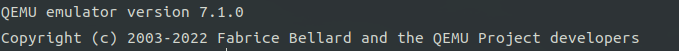

### 安装Ubuntu
#### 创建虚拟盘
- -f qcow2：磁盘格式为qcow2
- ubuntu.qcow2：磁盘名
- 30G：磁盘大小

```bash
qemu-img create -f qcow2 ubuntu.qcow2 30G
```
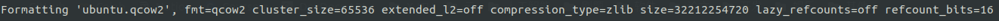
创建的虚拟磁盘文件默认在当前目录下，可以使用`ls`查看
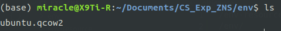
查看磁盘信息

```bash
qemu-img info ubuntu.qcow2
```
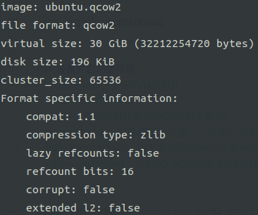
#### 设置并启动虚拟机
- --enable-kvm：使用KVM虚拟化
- -m 8G：8G虚拟内存
- -smp 2：模拟的SMP架构中CPU的个数为2
- -boot order=dc：引导顺序为 d(第一个光驱)->c(第一块硬盘)
- -hda /path/to/file：指定虚拟盘文件路径为/path/to/file
- -cdrom /path/to/iso：指定CD-ROM镜像文件的路径为/path/to/iso

```bash
qemu-system-x86_64 --enable-kvm -m 8G -smp 2 -boot order=dc -hda ./env/ubuntu.qcow2 -cdrom ./env-resource/ubuntu-22.04.1-live-server-amd64.iso
```
1. 选择Try or Install Ubuntu Server
   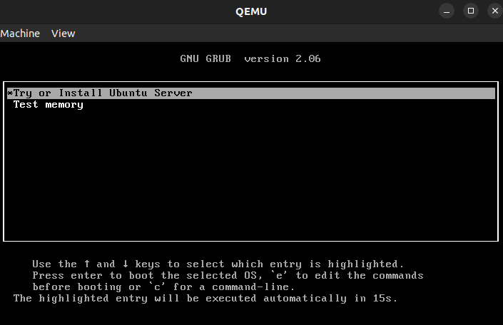

2. 语言选择English
   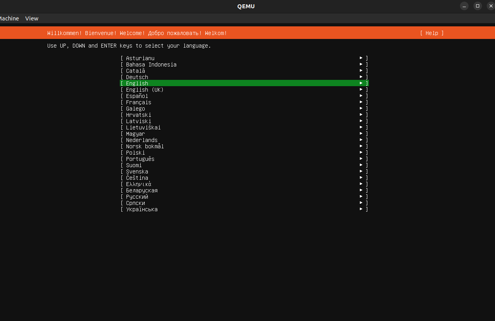

3. 不更新版本
   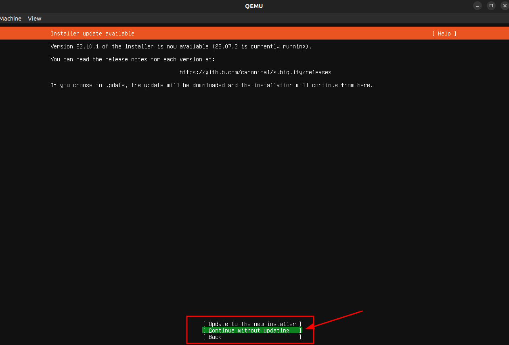

4. 键盘保持默认
   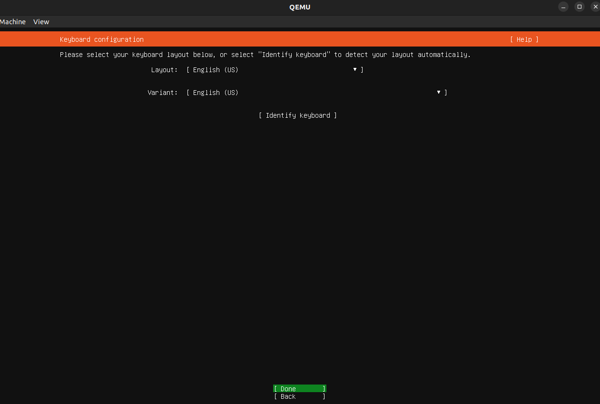

5. 选择完整安装
   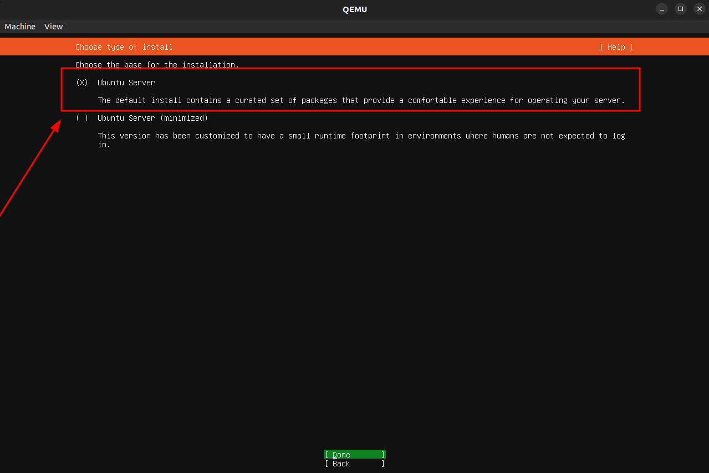

6. 网络部分选择DHCP自动获取，之后会通过端口映射方式暴露虚拟机端口

   **QEMU网络相关参数**

   >QEMU命令使用“-net user”参数配置用户模式网络，命令格式如下：
   >`qemu-kvm -net nic -net user [, opion[, option[, ... ] ] ]  myVM.img`
   >用户模式的参数选项描述如下：
   >
   >- vlan=vlan编号，将用户模式网络栈连接到编号为n的VLAN中（默认值为0）。
   >- name=名称，分配一个网络名称，可以用来在QEMU monitor中识别该网络。
   >- net=地址[/掩码]，设置客户机所在子网，缺省值是10.0.2.0/24。
   >- host=地址，设置客户机看到的宿主机IP地址，缺省值为客户机所在网络的第2个IP地址10.0.2.2。
   >- restrict=开关，如果将此选项打开（y或yes），则客户机不能与宿主机通信，也不能通过宿主机路由到外部网络。缺省设置为n或no。
   >- hostname=名称，设置在宿主机DHCP服务器中保存的客户机主机名。
   >- dhcpstart=地址，设置能够分配给客户机的第一个IP，QEMU内嵌的DHCP服务器有16个IP地址可供分配，缺省地址范围是10.0.2.15-10.0.2.30。
   >- dns=地址，指定虚拟DNS的地址，其缺省值是网络中的第3个IP地址10.0.2.3，不能与“host= ”中指定的相同。
   >- hostfwd=[tcpludp] [宿主机地址]：宿主机端口- [客户机地址]：客户机端口，将访问宿主机指定端口的TCP/UDP连接重定向到客户机端口上。该选项可以在一个命令行中可以多次重复使用。

   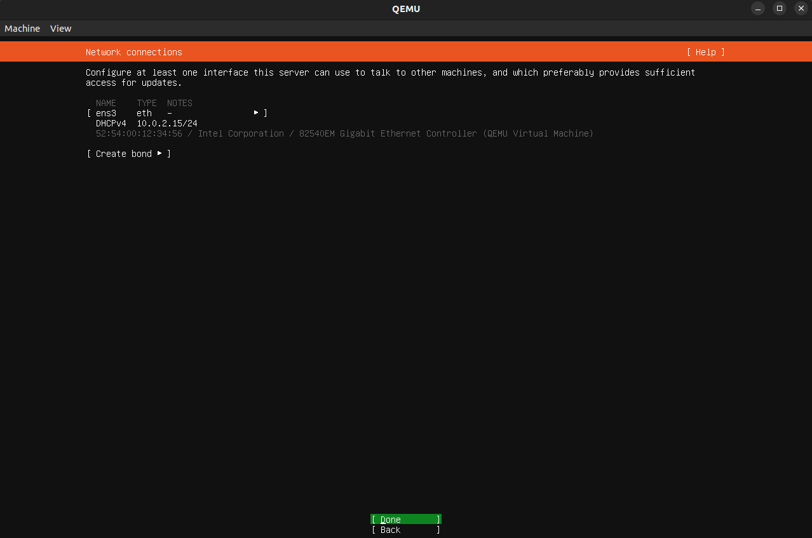

7. 不使用代理，此处留空即可
   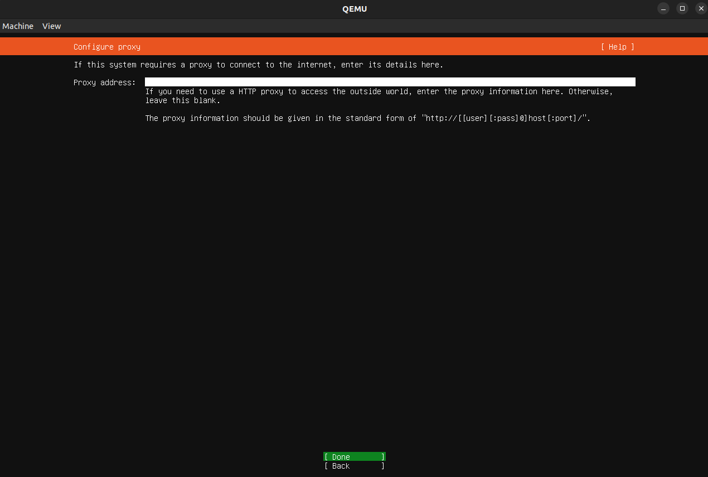

8. 镜像源保持默认即可，也可以换成阿里、清华等其他源
   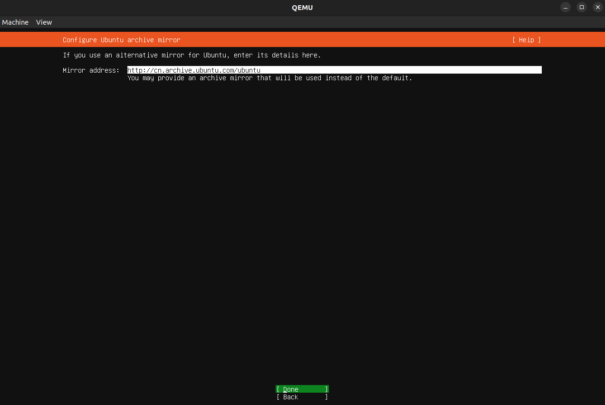

9. 没必要使用LVM逻辑卷，这里直接取消勾选
   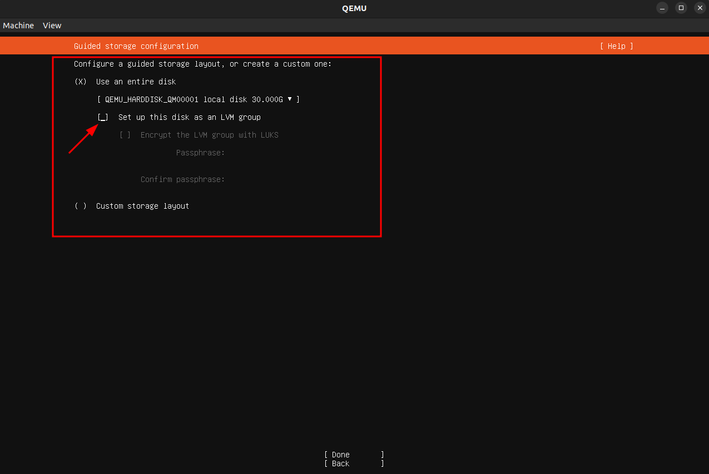

10. 确认分区没问题就下一步
    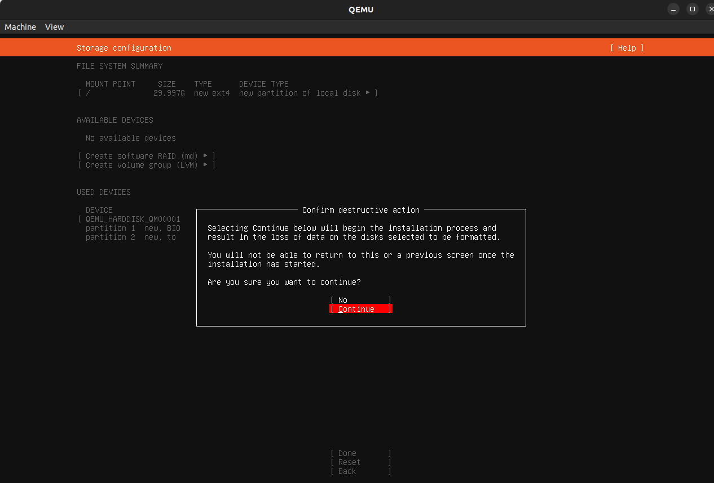

11. 设置主机名、用户名和密码
    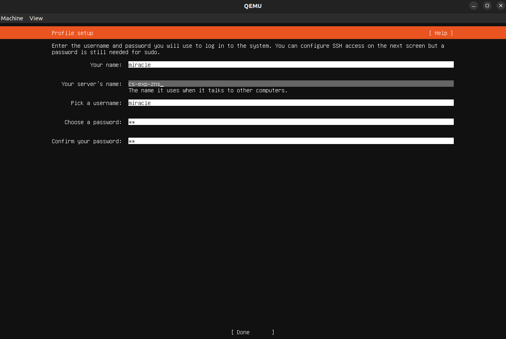

12. 勾选SSH
    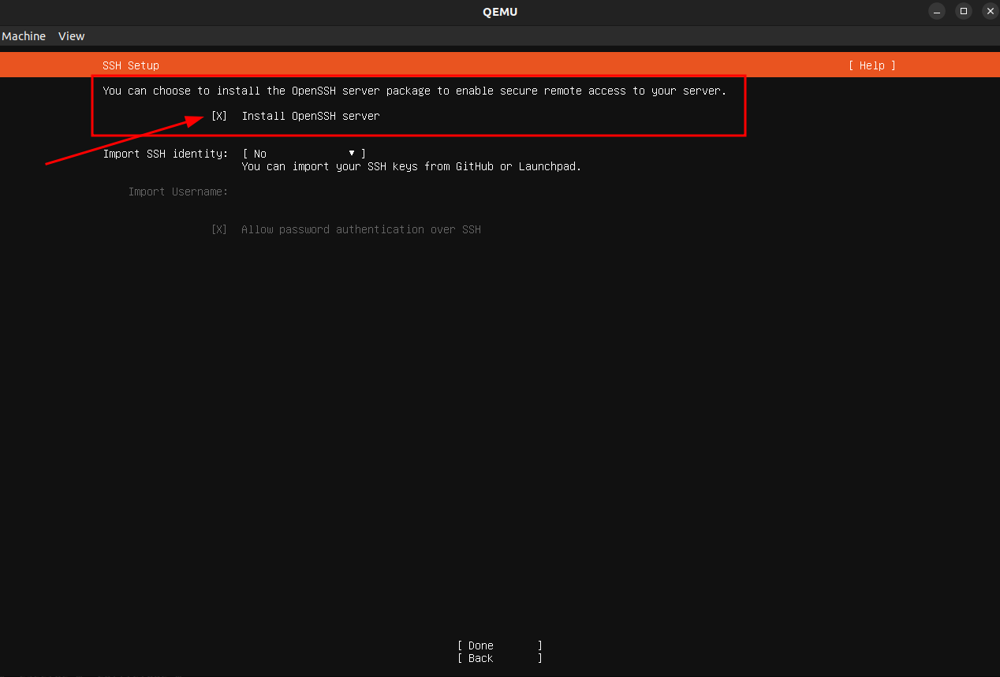

13. 其他的软件包用不着，直接下一步
    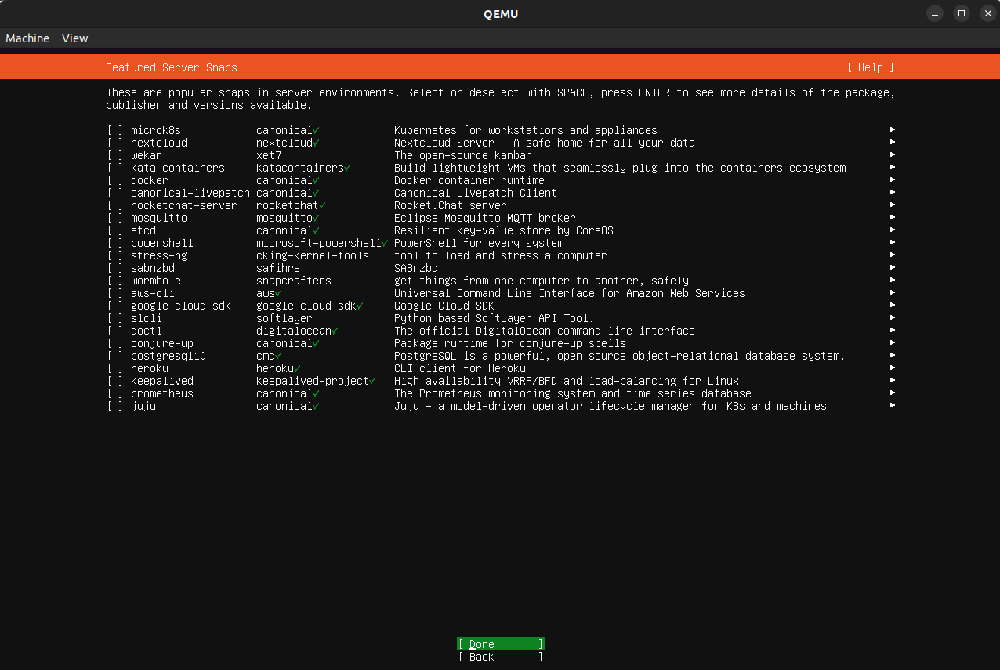

14. 等待安装完成后，点击左上角Machine选择Quit即可
    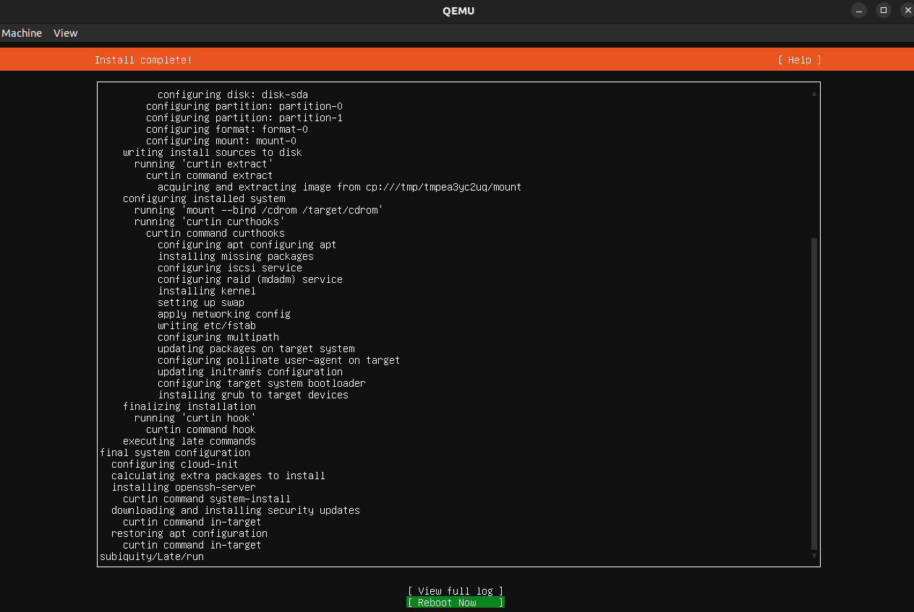

### 再创建一块虚拟盘用于模拟NVMe ZNS SSD
```bash
qemu-img create -f qcow2 znsssd.qcow2 10G
```
此时目录下应该有两个虚拟磁盘文件，一个是前文安装Ubuntu Server的系统盘，一个是用于模拟ZNS的虚拟盘
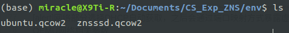

### 再次启动虚拟机并挂载两块硬盘
> [QEMU NVMe模拟 官方文档](https://www.qemu.org/docs/master/system/devices/nvme.html)

- -name：虚拟机名称
- -m：虚拟内存
- --enable-kvm：使用KVM虚拟化
- -cpu host：CPU虚拟化模型
	- x86 base：base CPU model type with no features enabled
	- x86 host ：processor with all supported host features
	- x86 max：Enables all features supported by the accelerator in the current host
- -smp 4：虚拟CPU个数
- -hda：系统盘路径
- -net user, -net nic：网络设置
- -drive：驱动
	- file：硬件映像文件路径
	- id：名称
	- format：格式
	- if：接口类型，即控制器类型，如ide、scsi、sd、mtd、floppy、pflash及virtio等
- -device nvme：添加NVMe设备（仅支持一个单独的namespace id为1的namespace）
	- serial：序列号
	- id：设备ID
- -device nvme-ns：为支持多个namespaces和额外特性，必须使用"nvme-ns"设备。 由"nvme-ns"设备定义的namespaces将连结到由"nvme"设备创建的"nvme-bus"。Namespace id自动分配，从1开始。
	- id：设备ID
	- drive：Node name or ID of a block device to use as a backend
	- nsid：namespace id
	- logical_block_size：逻辑块大小，512 B ～ 2 MiB （一般由1个或者多个物理块组合成一个逻辑块）
	- physical_block_size：物理块大小，512 B ～ 2 MiB
	- zoned：Zoned Namespace
		- zone_size：zone大小
		- zone_capacity：zone容量。若设置为0，zone容量等于zone大小
		- max_open：最大打开的资源数目，为0允许所有zone都打开
		- max_active：最大有效的资源数目，为0允许所有zone都有效
		- bus：将namespace关联到特定的nvme设备

```bash
qemu-system-x86_64 -name cs-exp-zns -m 8G --enable-kvm -cpu host -smp 4 \
-hda ./env/ubuntu.qcow2 \
-net user,hostfwd=tcp:127.0.0.1:7777-:22,hostfwd=tcp:127.0.0.1:2222-:2000 -net nic \
-drive file=./env/znsssd.qcow2,id=mynvme,format=qcow2,if=none \
-device nvme,serial=baz,id=nvme2 \
-device nvme-ns,id=ns2,drive=mynvme,nsid=2,logical_block_size=4096,physical_block_size=4096,zoned=true,zoned.zone_size=131072,zoned.zone_capacity=131072,zoned.max_open=0,zoned.max_active=0,bus=nvme2
```
### 查看NVMe设备
启动虚拟机后登陆，在dev下查看nvme设备是否存在

```bash
ls /dev/ | grep nv
```
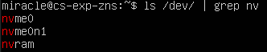
用nvme cli命令查看zns ssd设备信息

```bash
sudo apt update
sudo apt full-upgrade
reboot
```
```bash
sudo apt install nvme-cli
sudo nvme zns id-ns /dev/nvme0n1 -H
```
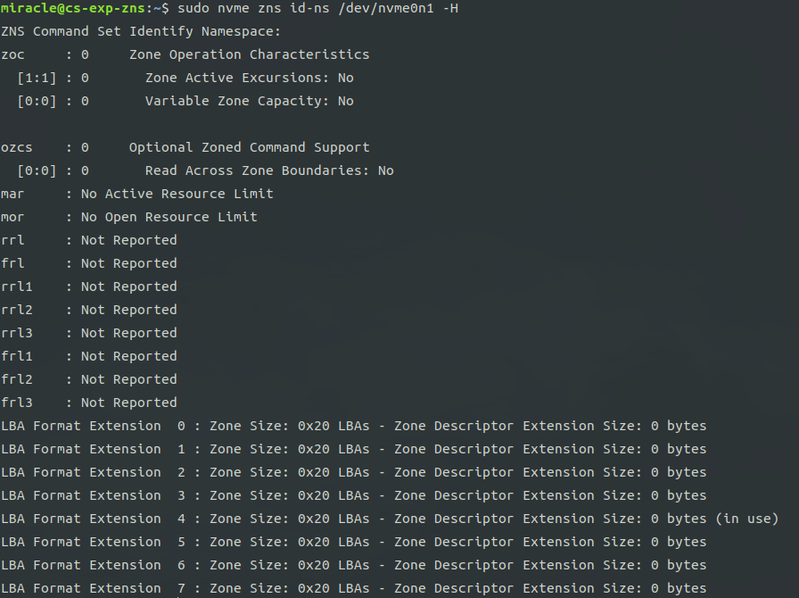

### 额外工作
#### 目录共享
添加共享目录优点

- [x] 便于保存LOG文件至宿主机
- [x] 可以在宿主机直接编写代码
- [x] 便于文件传输
- [ ] ...

在启动参数中添加共享配置

- path：主机目录路径
- mount_tag：mount标签，后续在虚拟机里挂载会用到

```bash
-fsdev local,id=fsdev0,path=./work/,security_model=none \
-device virtio-9p-pci,id=fs0,fsdev=fsdev0,mount_tag=hostshare
```
启动虚拟机后挂载共享目录

```bash
cd ~
mkdir work
sudo mount hostshare -t 9p ./work
```
这样当前目录下的更改就会实时同步到虚拟机和宿主机中了

#### 保存启动配置
`vim start.sh`

```shell
#! /bin/bash
cd ~/Documents/CS_Exp_ZNS
qemu-system-x86_64 -name cs-exp-zns -m 8G --enable-kvm -cpu host -smp 4 \
-hda ./env/ubuntu.qcow2 \
-net user,hostfwd=tcp:127.0.0.1:7777-:22,hostfwd=tcp:127.0.0.1:2222-:2000 -net nic \
-drive file=./env/znsssd.qcow2,id=mynvme,format=qcow2,if=none \
-device nvme,serial=baz,id=nvme2 \
-device nvme-ns,id=ns2,drive=mynvme,nsid=2,logical_block_size=4096,physical_block_size=4096,zoned=true,zoned.zone_size=131072,zoned.zone_capacity=131072,zoned.max_open=0,zoned.max_active=0,bus=nvme2 \
-fsdev local,id=fsdev0,path=./work/,security_model=none \
-device virtio-9p-pci,id=fs0,fsdev=fsdev0,mount_tag=hostshare
```
`chmod +x ./start.sh`
之后使用`./start.sh`就可以快速启动虚拟机了

## 实验结论和心得体会

本次实验成功编译安装了QEMU并掌握了基于QEMU的NVMe ZNS SSD模拟方法。
