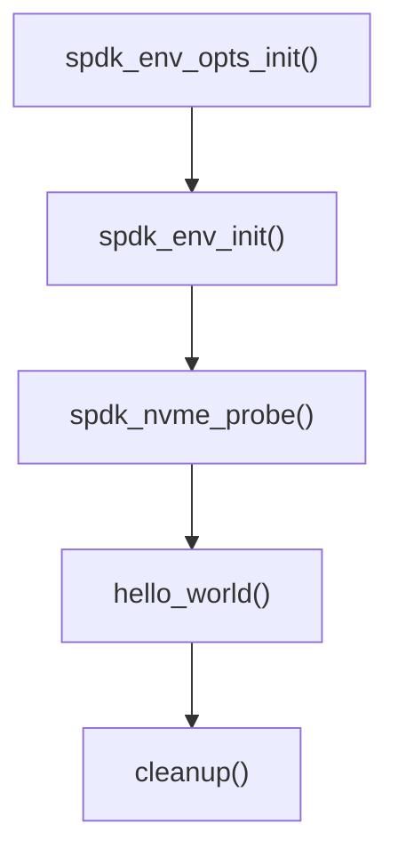
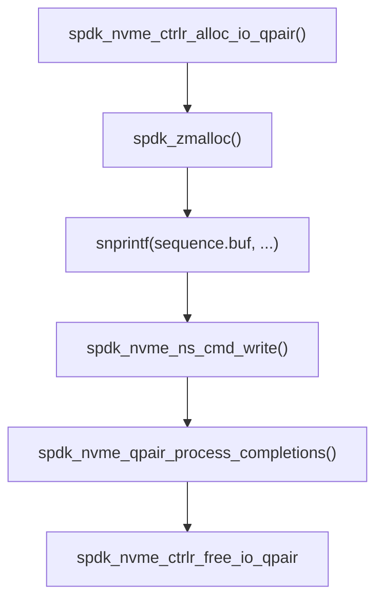
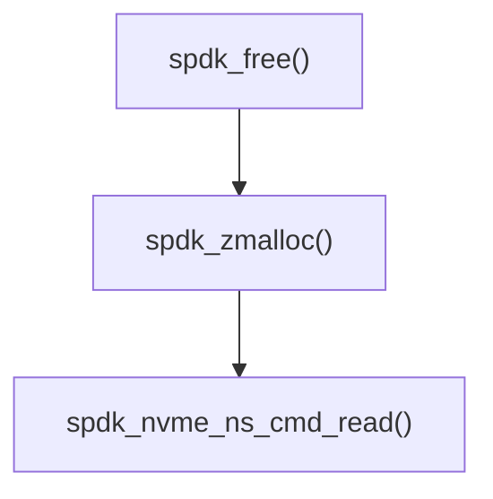
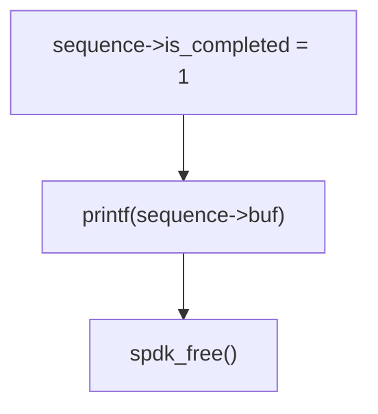
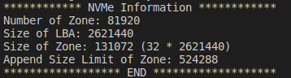
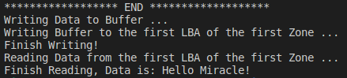

# 实验二、SPDK安装和使用

## 实验目的
- 本实验涉及到计算机组成原理、操作系统、程序设计等多门课程知识，锻炼同学们对业界最新软硬件技术全栈开发能力和学习能力
- NVMe协议已成为最新SSD访问协议，ZNS SSD是最新SSD技术发展成果，NVMe最新协议已增加对ZNS SSD支持， ZNS SSD对于存储系统性能提升有重要意义。本实验通过使用QEMU模拟ZNS SSD设备，基于Intel SPDK框架，在应用中使用ZNS SSD作为底层存储并实现I/O访问，理解从应用层到物理存储设备之间数据读写原理

## 实验内容
- 下载SPDK源代码并编译安装
- 运行NVME hello world程序
- 通过分析NVME hello world源码学习SPDK基本原理
- 修改hello world，实现zns命令I/O读写

## 实验过程和步骤
### 下载SPDK源代码并编译安装
1. 下载源码
```bash
git clone https://github.com/spdk/spdk
cd spdk
git submodule update --init
```
2. 下载依赖
```bash
sudo scripts/pkgdep.sh –all
```
> - The scripts/pkgdep.sh script will automatically install the bare minimum dependencies required to build SPDK. Use --help to see information on installing dependencies for optional components
> - Option –all will install all dependencies needed by SPDK features

3. 编译
```bash
./configure
make
```
4. 单元测试
```bash
./test/unit/unittest.sh
```
> You will see several error messages when running the unit tests, but they are part of the test suite. The final message at the end of the script indicates success or failure
>
> 

5. 安装
```bash
sudo make install
```

### 运行NVME hello world程序

1. 页分配与设备解绑
```bash
sudo scripts/setup.sh
```
> - Before running an SPDK application, some hugepages must be allocated and any NVMe and I/OAT devices must be unbound from the native kernel drivers. SPDK includes a script to automate this process on both Linux and FreeBSD. This script should be run as root. It only needs to be run once on the system
> - To rebind devices back to the kernel, you can run
> ```bash
> sudo scripts/setup.sh reset
> ```
> - By default, the script allocates 2048MB of hugepages. To change this number, specify HUGEMEM (in MB) as follows:
> ```bash
> sudo HUGEMEM=4096 scripts/setup.sh
> ```
> On Linux machines HUGEMEM will be rounded up to system-default huge page size boundary

2. 运行hello world程序
```bash
sudo ./build/examples/hello_world
```


### 通过分析NVME hello world源码学习SPDK基本原理
在 `spdk/examples/nvme/hello_world/hello_world.c` 下查看hello world源码并对关键部分进行分析

1. `main()` 函数处理流程

```c
int main(int argc, char **argv)
{
	int rc;
	struct spdk_env_opts opts;

	/*
	 * SPDK relies on an abstraction around the local environment
	 * named env that handles memory allocation and PCI device operations.
	 * This library must be initialized first.
	 *
	 */
	spdk_env_opts_init(&opts);
	rc = parse_args(argc, argv, &opts);
	if (rc != 0) {
		return rc;
	}

	opts.name = "hello_world";
	if (spdk_env_init(&opts) < 0) {
		fprintf(stderr, "Unable to initialize SPDK env\n");
		return 1;
	}

	printf("Initializing NVMe Controllers\n");

	if (g_vmd && spdk_vmd_init()) {
		fprintf(stderr, "Failed to initialize VMD."
			" Some NVMe devices can be unavailable.\n");
	}

	/*
	 * Start the SPDK NVMe enumeration process.  probe_cb will be called
	 *  for each NVMe controller found, giving our application a choice on
	 *  whether to attach to each controller.  attach_cb will then be
	 *  called for each controller after the SPDK NVMe driver has completed
	 *  initializing the controller we chose to attach.
	 */
	rc = spdk_nvme_probe(&g_trid, NULL, probe_cb, attach_cb, NULL);
	if (rc != 0) {
		fprintf(stderr, "spdk_nvme_probe() failed\n");
		rc = 1;
		goto exit;
	}

	if (TAILQ_EMPTY(&g_controllers)) {
		fprintf(stderr, "no NVMe controllers found\n");
		rc = 1;
		goto exit;
	}

	printf("Initialization complete.\n");
	hello_world();
	cleanup();
	if (g_vmd) {
		spdk_vmd_fini();
	}

exit:
	cleanup();
	spdk_env_fini();
	return rc;
}

```

可以看到 `main()` 函数的主要流程为

其中：
- `spdk_env_opts_init()` 初始化opts参数
- `spdk_env_init()` 初始化环境
- `spdk_nvme_probe()` 加载NVMe设备：通过transport ID枚举总线，并将用户空间NVMe驱动程序附加到发现的每个设备上，具体参数如下
> `int spdk_nvme_probe(const struct spdk_nvme_transport_id *trid, void *cb_ctx, spdk_nvme_probe_cb probe_cb, spdk_nvme_attach_cb attach_cb, spdk_nvme_remove_cb remove_cb)`
> - trid – The transport ID indicating which bus to enumerate. If the trtype is PCIe or trid is NULL, this will scan the local PCIe bus. If the trtype is RDMA, the traddr and trsvcid must point at the location of an NVMe-oF discovery service.
> - cb_ctx – Opaque value which will be passed back in cb_ctx parameter of the callbacks.
> - probe_cb – will be called once per NVMe device found in the system.
> - attach_cb – will be called for devices for which probe_cb returned true once that NVMe controller has been attached to the userspace driver.
> - remove_cb – will be called for devices that were attached in a previous spdk_nvme_probe() call but are no longer attached to the system. Optional; specify NULL if removal notices are not desired.
>
> 返回: 0 on success, -1 on failure.
- `hello_world()` 进行读写操作
- `cleanup()` 释放NVMe设备

接着对 `hello_world()` 函数进行分析
```c
static void hello_world(void)
{
	struct ns_entry			*ns_entry;
	struct hello_world_sequence	sequence;
	int				rc;
	size_t				sz;

	TAILQ_FOREACH(ns_entry, &g_namespaces, link) {
		/*
		 * Allocate an I/O qpair that we can use to submit read/write requests
		 *  to namespaces on the controller.  NVMe controllers typically support
		 *  many qpairs per controller.  Any I/O qpair allocated for a controller
		 *  can submit I/O to any namespace on that controller.
		 *
		 * The SPDK NVMe driver provides no synchronization for qpair accesses -
		 *  the application must ensure only a single thread submits I/O to a
		 *  qpair, and that same thread must also check for completions on that
		 *  qpair.  This enables extremely efficient I/O processing by making all
		 *  I/O operations completely lockless.
		 */
		ns_entry->qpair = spdk_nvme_ctrlr_alloc_io_qpair(ns_entry->ctrlr, NULL, 0);
		if (ns_entry->qpair == NULL) {
			printf("ERROR: spdk_nvme_ctrlr_alloc_io_qpair() failed\n");
			return;
		}

		/*
		 * Use spdk_dma_zmalloc to allocate a 4KB zeroed buffer.  This memory
		 * will be pinned, which is required for data buffers used for SPDK NVMe
		 * I/O operations.
		 */
		sequence.using_cmb_io = 1;
		sequence.buf = spdk_nvme_ctrlr_map_cmb(ns_entry->ctrlr, &sz);
		if (sequence.buf == NULL || sz < 0x1000) {
			sequence.using_cmb_io = 0;
			sequence.buf = spdk_zmalloc(0x1000, 0x1000, NULL, SPDK_ENV_SOCKET_ID_ANY, SPDK_MALLOC_DMA);
		}
		if (sequence.buf == NULL) {
			printf("ERROR: write buffer allocation failed\n");
			return;
		}
		if (sequence.using_cmb_io) {
			printf("INFO: using controller memory buffer for IO\n");
		} else {
			printf("INFO: using host memory buffer for IO\n");
		}
		sequence.is_completed = 0;
		sequence.ns_entry = ns_entry;

		/*
		 * If the namespace is a Zoned Namespace, rather than a regular
		 * NVM namespace, we need to reset the first zone, before we
		 * write to it. This not needed for regular NVM namespaces.
		 */
		if (spdk_nvme_ns_get_csi(ns_entry->ns) == SPDK_NVME_CSI_ZNS) {
			reset_zone_and_wait_for_completion(&sequence);
		}

		/*
		 * Print "Hello world!" to sequence.buf.  We will write this data to LBA
		 *  0 on the namespace, and then later read it back into a separate buffer
		 *  to demonstrate the full I/O path.
		 */
		snprintf(sequence.buf, 0x1000, "%s", "Hello world!\n");

		/*
		 * Write the data buffer to LBA 0 of this namespace.  "write_complete" and
		 *  "&sequence" are specified as the completion callback function and
		 *  argument respectively.  write_complete() will be called with the
		 *  value of &sequence as a parameter when the write I/O is completed.
		 *  This allows users to potentially specify different completion
		 *  callback routines for each I/O, as well as pass a unique handle
		 *  as an argument so the application knows which I/O has completed.
		 *
		 * Note that the SPDK NVMe driver will only check for completions
		 *  when the application calls spdk_nvme_qpair_process_completions().
		 *  It is the responsibility of the application to trigger the polling
		 *  process.
		 */
		rc = spdk_nvme_ns_cmd_write(ns_entry->ns, ns_entry->qpair, sequence.buf,
					    0, /* LBA start */
					    1, /* number of LBAs */
					    write_complete, &sequence, 0);
		if (rc != 0) {
			fprintf(stderr, "starting write I/O failed\n");
			exit(1);
		}

		/*
		 * Poll for completions.  0 here means process all available completions.
		 *  In certain usage models, the caller may specify a positive integer
		 *  instead of 0 to signify the maximum number of completions it should
		 *  process.  This function will never block - if there are no
		 *  completions pending on the specified qpair, it will return immediately.
		 *
		 * When the write I/O completes, write_complete() will submit a new I/O
		 *  to read LBA 0 into a separate buffer, specifying read_complete() as its
		 *  completion routine.  When the read I/O completes, read_complete() will
		 *  print the buffer contents and set sequence.is_completed = 1.  That will
		 *  break this loop and then exit the program.
		 */
		while (!sequence.is_completed) {
			spdk_nvme_qpair_process_completions(ns_entry->qpair, 0);
		}

		/*
		 * Free the I/O qpair.  This typically is done when an application exits.
		 *  But SPDK does support freeing and then reallocating qpairs during
		 *  operation.  It is the responsibility of the caller to ensure all
		 *  pending I/O are completed before trying to free the qpair.
		 */
		spdk_nvme_ctrlr_free_io_qpair(ns_entry->qpair);
	}
}
```
可以看到 `hello_world()` 函数的主要流程为

其中：
- `spdk_nvme_ctrlr_alloc_io_qpair()` 为控制器分配I/O qpair
- `spdk_zmalloc()` 分配buffer
- `snprintf(sequence.buf, ...)` 写入数据到buffer
- `spdk_nvme_ns_cmd_write()` 从buffer写入namespace的LBA 0处
- `spdk_nvme_qpair_process_completions()` 处理I/O Completions
- `spdk_nvme_ctrlr_free_io_qpair` 释放I/O qpair

在本程序中，当写 I/O 完成时， `write_complete()` 中调用了 `spdk_nvme_ns_cmd_read()` 进行读取操作。 当读取 I/O 完成时，`read_complete()` 将打印缓冲区内容并设置  `sequence.is_completed = 1`

`write_complete()` 函数
```c
static void write_complete(void *arg, const struct spdk_nvme_cpl *completion)
{
	struct hello_world_sequence	*sequence = arg;
	struct ns_entry			*ns_entry = sequence->ns_entry;
	int				rc;

	/* See if an error occurred. If so, display information
	 * about it, and set completion value so that I/O
	 * caller is aware that an error occurred.
	 */
	if (spdk_nvme_cpl_is_error(completion)) {
		spdk_nvme_qpair_print_completion(sequence->ns_entry->qpair, (struct spdk_nvme_cpl *)completion);
		fprintf(stderr, "I/O error status: %s\n", spdk_nvme_cpl_get_status_string(&completion->status));
		fprintf(stderr, "Write I/O failed, aborting run\n");
		sequence->is_completed = 2;
		exit(1);
	}
	/*
	 * The write I/O has completed.  Free the buffer associated with
	 *  the write I/O and allocate a new zeroed buffer for reading
	 *  the data back from the NVMe namespace.
	 */
	if (sequence->using_cmb_io) {
		spdk_nvme_ctrlr_unmap_cmb(ns_entry->ctrlr);
	} else {
		spdk_free(sequence->buf);
	}
	sequence->buf = spdk_zmalloc(0x1000, 0x1000, NULL, SPDK_ENV_SOCKET_ID_ANY, SPDK_MALLOC_DMA);

	rc = spdk_nvme_ns_cmd_read(ns_entry->ns, ns_entry->qpair, sequence->buf,
				   0, /* LBA start */
				   1, /* number of LBAs */
				   read_complete, (void *)sequence, 0);
	if (rc != 0) {
		fprintf(stderr, "starting read I/O failed\n");
		exit(1);
	}
}
```
`write_complete()` 流程

其中：
- `spdk_free()` 释放write时分配的buffer
- `spdk_zmalloc()` 为read分配buffer
- `spdk_nvme_ns_cmd_read()` 将namespace的LBA 0读入到buffer中

`read_complete()` 函数
```c
static void read_complete(void *arg, const struct spdk_nvme_cpl *completion)
{
	struct hello_world_sequence *sequence = arg;

	/* Assume the I/O was successful */
	sequence->is_completed = 1;
	/* See if an error occurred. If so, display information
	 * about it, and set completion value so that I/O
	 * caller is aware that an error occurred.
	 */
	if (spdk_nvme_cpl_is_error(completion)) {
		spdk_nvme_qpair_print_completion(sequence->ns_entry->qpair, (struct spdk_nvme_cpl *)completion);
		fprintf(stderr, "I/O error status: %s\n", spdk_nvme_cpl_get_status_string(&completion->status));
		fprintf(stderr, "Read I/O failed, aborting run\n");
		sequence->is_completed = 2;
		exit(1);
	}

	/*
	 * The read I/O has completed.  Print the contents of the
	 *  buffer, free the buffer, then mark the sequence as
	 *  completed.  This will trigger the hello_world() function
	 *  to exit its polling loop.
	 */
	printf("%s", sequence->buf);
	spdk_free(sequence->buf);
}
```
`read_complete()` 流程

 	其中：
- `sequence->is_completed = 1` 修改完成标识，使hello_world中while退出
- `printf("%s", sequence->buf)` 将buffer中数据输出
- `spdk_free()` 释放read的buffer

### 修改hello world，实现zns命令I/O读写

#### hello_miracle源代码

```c
#include "spdk/stdinc.h"
#include "spdk/nvme.h"
#include "spdk/vmd.h"
#include "spdk/nvme_zns.h"
#include "spdk/env.h"
#include "spdk/string.h"
#include "spdk/log.h"

struct ctrlr_entry
{
    struct spdk_nvme_ctrlr *ctrlr;
    TAILQ_ENTRY(ctrlr_entry) link;
    char name[1024];
};

struct ns_entry
{
    struct spdk_nvme_ctrlr *ctrlr;
    struct spdk_nvme_ns *ns;
    TAILQ_ENTRY(ns_entry) link;
    struct spdk_nvme_qpair *qpair;
};

struct my_sequence
{
    struct ns_entry *ns_entry;
    char *buf;
    unsigned using_cmb_io;
    int is_completed;
};

static TAILQ_HEAD(, ctrlr_entry) g_controllers = TAILQ_HEAD_INITIALIZER(g_controllers);
static TAILQ_HEAD(, ns_entry) g_namespaces = TAILQ_HEAD_INITIALIZER(g_namespaces);
static struct spdk_nvme_transport_id g_trid = {};

static bool g_vmd = false;

static void register_ns(struct spdk_nvme_ctrlr *ctrlr, struct spdk_nvme_ns *ns)
{
    struct ns_entry *entry;

    if (!spdk_nvme_ns_is_active(ns))
    {
        return;
    }

    entry = malloc(sizeof(struct ns_entry));
    if (entry == NULL)
    {
        perror("ns_entry malloc");
        exit(1);
    }

    entry->ctrlr = ctrlr;
    entry->ns = ns;
    TAILQ_INSERT_TAIL(&g_namespaces, entry, link);

    printf("  Namespace ID: %d size: %juGB\n", spdk_nvme_ns_get_id(ns),
           spdk_nvme_ns_get_size(ns) / 1000000000);
}

static bool probe_cb(void *cb_ctx, const struct spdk_nvme_transport_id *trid, struct spdk_nvme_ctrlr_opts *opts)
{
    printf("Attaching to %s\n", trid->traddr);
    return true;
}

static void attach_cb(void *cb_ctx, const struct spdk_nvme_transport_id *trid, struct spdk_nvme_ctrlr *ctrlr, const struct spdk_nvme_ctrlr_opts *opts)
{
    int nsid;
    struct ctrlr_entry *entry;
    struct spdk_nvme_ns *ns;
    const struct spdk_nvme_ctrlr_data *cdata;

    entry = malloc(sizeof(struct ctrlr_entry));
    if (entry == NULL)
    {
        perror("ctrlr_entry malloc");
        exit(1);
    }

    printf("Attached to %s\n", trid->traddr);

    cdata = spdk_nvme_ctrlr_get_data(ctrlr);

    snprintf(entry->name, sizeof(entry->name), "%-20.20s (%-20.20s)", cdata->mn, cdata->sn);

    entry->ctrlr = ctrlr;
    TAILQ_INSERT_TAIL(&g_controllers, entry, link);

    for (nsid = spdk_nvme_ctrlr_get_first_active_ns(ctrlr); nsid != 0;
         nsid = spdk_nvme_ctrlr_get_next_active_ns(ctrlr, nsid))
    {
        ns = spdk_nvme_ctrlr_get_ns(ctrlr, nsid);
        if (ns == NULL)
        {
            continue;
        }
        register_ns(ctrlr, ns);
    }
}

static void cleanup(void)
{
    struct ns_entry *ns_entry, *tmp_ns_entry;
    struct ctrlr_entry *ctrlr_entry, *tmp_ctrlr_entry;
    struct spdk_nvme_detach_ctx *detach_ctx = NULL;

    TAILQ_FOREACH_SAFE(ns_entry, &g_namespaces, link, tmp_ns_entry)
    {
        TAILQ_REMOVE(&g_namespaces, ns_entry, link);
        free(ns_entry);
    }

    TAILQ_FOREACH_SAFE(ctrlr_entry, &g_controllers, link, tmp_ctrlr_entry)
    {
        TAILQ_REMOVE(&g_controllers, ctrlr_entry, link);
        spdk_nvme_detach_async(ctrlr_entry->ctrlr, &detach_ctx);
        free(ctrlr_entry);
    }

    if (detach_ctx)
    {
        spdk_nvme_detach_poll(detach_ctx);
    }
}

static void usage(const char *program_name)
{
    printf("%s [options]", program_name);
    printf("\t\n");
    printf("options:\n");
    printf("\t[-d DPDK huge memory size in MB]\n");
    printf("\t[-g use single file descriptor for DPDK memory segments]\n");
    printf("\t[-i shared memory group ID]\n");
    printf("\t[-r remote NVMe over Fabrics target address]\n");
    printf("\t[-V enumerate VMD]\n");
#ifdef DEBUG
    printf("\t[-L enable debug logging]\n");
#else
    printf("\t[-L enable debug logging (flag disabled, must reconfigure with --enable-debug)]\n");
#endif
}

static int parse_args(int argc, char **argv, struct spdk_env_opts *env_opts)
{
    int op, rc;

    spdk_nvme_trid_populate_transport(&g_trid, SPDK_NVME_TRANSPORT_PCIE);
    snprintf(g_trid.subnqn, sizeof(g_trid.subnqn), "%s", SPDK_NVMF_DISCOVERY_NQN);

    while ((op = getopt(argc, argv, "d:gi:r:L:V")) != -1)
    {
        switch (op)
        {
        case 'V':
            g_vmd = true;
            break;
        case 'i':
            env_opts->shm_id = spdk_strtol(optarg, 10);
            if (env_opts->shm_id < 0)
            {
                fprintf(stderr, "Invalid shared memory ID\n");
                return env_opts->shm_id;
            }
            break;
        case 'g':
            env_opts->hugepage_single_segments = true;
            break;
        case 'r':
            if (spdk_nvme_transport_id_parse(&g_trid, optarg) != 0)
            {
                fprintf(stderr, "Error parsing transport address\n");
                return 1;
            }
            break;
        case 'd':
            env_opts->mem_size = spdk_strtol(optarg, 10);
            if (env_opts->mem_size < 0)
            {
                fprintf(stderr, "Invalid DPDK memory size\n");
                return env_opts->mem_size;
            }
            break;
        case 'L':
            rc = spdk_log_set_flag(optarg);
            if (rc < 0)
            {
                fprintf(stderr, "unknown flag\n");
                usage(argv[0]);
                exit(EXIT_FAILURE);
            }
#ifdef DEBUG
            spdk_log_set_print_level(SPDK_LOG_DEBUG);
#endif
            break;
        default:
            usage(argv[0]);
            return 1;
        }
    }

    return 0;
}

static void reset_zone_complete(void *arg, const struct spdk_nvme_cpl *completion)
{
	struct my_sequence *sequence = arg;

	sequence->is_completed = 1;
	if (spdk_nvme_cpl_is_error(completion)) {
		spdk_nvme_qpair_print_completion(sequence->ns_entry->qpair, (struct spdk_nvme_cpl *)completion);
		fprintf(stderr, "I/O error status: %s\n", spdk_nvme_cpl_get_status_string(&completion->status));
		fprintf(stderr, "Reset zone I/O failed, aborting run\n");
		sequence->is_completed = 2;
		exit(1);
	}
}

static void reset_zone_and_wait_for_completion(struct my_sequence *sequence)
{
	if (spdk_nvme_zns_reset_zone(sequence->ns_entry->ns, sequence->ns_entry->qpair,
				     0, /* starting LBA of the zone to reset */
				     false, /* don't reset all zones */
				     reset_zone_complete,
				     sequence)) {
		fprintf(stderr, "starting reset zone I/O failed\n");
		exit(1);
	}
	while (!sequence->is_completed) {
		spdk_nvme_qpair_process_completions(sequence->ns_entry->qpair, 0);
	}
	sequence->is_completed = 0;
}

bool io_completed;
static void check_completion(void *arg, const struct spdk_nvme_cpl *cpl)
{
    if (spdk_nvme_cpl_is_error(cpl))
    {
        printf("I/O Option Failed\n");
    }
    io_completed = true;
}

static void print_zns_zone(uint8_t *report, uint32_t index, uint32_t zdes)
{
	struct spdk_nvme_zns_zone_desc *desc;
	uint32_t i, zds, zrs, zd_index;

	zrs = sizeof(struct spdk_nvme_zns_zone_report);
	zds = sizeof(struct spdk_nvme_zns_zone_desc);
	zd_index = zrs + index * (zds + zdes);

	desc = (struct spdk_nvme_zns_zone_desc *)(report + zd_index);

	printf("ZSLBA: 0x%016"PRIx64" ZCAP: 0x%016"PRIx64" WP: 0x%016"PRIx64" ZS: ", desc->zslba,
	       desc->zcap, desc->wp);
	switch (desc->zs) {
	case SPDK_NVME_ZONE_STATE_EMPTY:
		printf("Empty");
		break;
	case SPDK_NVME_ZONE_STATE_IOPEN:
		printf("Implicit open");
		break;
	case SPDK_NVME_ZONE_STATE_EOPEN:
		printf("Explicit open");
		break;
	case SPDK_NVME_ZONE_STATE_CLOSED:
		printf("Closed");
		break;
	case SPDK_NVME_ZONE_STATE_RONLY:
		printf("Read only");
		break;
	case SPDK_NVME_ZONE_STATE_FULL:
		printf("Full");
		break;
	case SPDK_NVME_ZONE_STATE_OFFLINE:
		printf("Offline");
		break;
	default:
		printf("Reserved");
	}
	printf(" ZT: %s ZA: %x\n", (desc->zt == SPDK_NVME_ZONE_TYPE_SEQWR) ? "SWR" : "Reserved",
	       desc->za.raw);

	if (!desc->za.bits.zdev) {
		return;
	}

	for (i = 0; i < zdes; i += 8) {
		printf("zone_desc_ext[%d] : 0x%"PRIx64"\n", i,
		       *(uint64_t *)(report + zd_index + zds + i));
	}
}

static void hello_miracle(void)
{
	struct ns_entry			*ns_entry;
	struct my_sequence	sequence;
	int				rc;
	size_t				sz;

    ns_entry = g_namespaces.tqh_first;
    ns_entry->qpair = spdk_nvme_ctrlr_alloc_io_qpair(ns_entry->ctrlr, NULL, 0);
    if (ns_entry->qpair == NULL) {
        printf("ERROR: spdk_nvme_ctrlr_alloc_io_qpair() failed\n");
        return;
    }
    sequence.using_cmb_io = 1;
    sequence.buf = spdk_nvme_ctrlr_map_cmb(ns_entry->ctrlr, &sz);
    if (sequence.buf == NULL || sz < 0x1000) {
        sequence.using_cmb_io = 0;
        sequence.buf = spdk_zmalloc(0x1000, 0x1000, NULL, SPDK_ENV_SOCKET_ID_ANY, SPDK_MALLOC_DMA);
    }
    if (sequence.buf == NULL) {
        printf("ERROR: write buffer allocation failed\n");
        return;
    }
    if (sequence.using_cmb_io) {
        printf("INFO: using controller memory buffer for IO\n");
    } else {
        printf("INFO: using host memory buffer for IO\n");
    }
    sequence.is_completed = 0;
    sequence.ns_entry = ns_entry;

    reset_zone_and_wait_for_completion(&sequence);


    /**
     * @brief zns ssd info
     * 
     */
    uint64_t num_zones = spdk_nvme_zns_ns_get_num_zones(ns_entry->ns);
    uint64_t zone_size = spdk_nvme_zns_ns_get_zone_size(ns_entry->ns);
    uint32_t zone_append_size_limit = spdk_nvme_zns_ctrlr_get_max_zone_append_size(ns_entry->ctrlr);
    const struct spdk_nvme_ns_data *ref_ns_data = spdk_nvme_ns_get_data(ns_entry->ns);
    const struct spdk_nvme_zns_ns_data *ref_ns_zns_data = spdk_nvme_zns_ns_get_data(ns_entry->ns);
    printf("************ NVMe Information ************\n");
    printf("Number of Zone: %lu\n", num_zones);
    printf("Size of LBA: %lu\n", ref_ns_data->nsze);
    printf("Size of Zone: %lu (%lu * %lu)\n", zone_size, ref_ns_zns_data->lbafe->zsze, ref_ns_data->nsze);
    printf("Append Size Limit of Zone: %u\n", zone_append_size_limit);
    printf("****************** END *******************\n");

    uint8_t *report_buf;
    size_t report_buf_size;
    uint64_t nr_zones = 0;
    uint64_t max_zones_per_buf;
    uint32_t zds, zrs, zd_index;
    size_t zdes = 0;

    zrs = sizeof(struct spdk_nvme_zns_zone_report);
    zds = sizeof(struct spdk_nvme_zns_zone_desc);

    report_buf_size = spdk_nvme_ns_get_max_io_xfer_size(ns_entry->ns);
    report_buf = calloc(1, report_buf_size);
    if (!report_buf)
    {
        printf("Zone report allocation failed!\n");
        return;
    }
    memset(report_buf, 0, report_buf_size);

    
    max_zones_per_buf = (report_buf_size - zrs) / zds;
    rc = spdk_nvme_zns_report_zones(ns_entry->ns, ns_entry->qpair, report_buf, report_buf_size, 0, SPDK_NVME_ZRA_LIST_ALL, true, check_completion, NULL);
    if (rc)
    {
        fprintf(stderr, "Report zones failed\n");
        return;
    }

    io_completed = false;
    while (!io_completed)
    {
        spdk_nvme_qpair_process_completions(ns_entry->qpair, 0);
    }
    nr_zones = report_buf[0];
    if (nr_zones > max_zones_per_buf)
    {
        fprintf(stderr, "nr_zones too big\n");
        return;
    }
    if (!nr_zones)
    {
        return;
    }

    printf("************ Zone Information ************\n");
    uint32_t i;
    for (i = 0; i < nr_zones && i < num_zones; ++ i)
    {
        print_zns_zone(report_buf, i, zdes);
    }
    printf("****************** END *******************\n");

    struct spdk_nvme_zns_zone_desc *first_zone_info;
    zd_index = zrs + 0 * (zds + zdes);
    first_zone_info = (struct spdk_nvme_zns_zone_desc *)(report_buf + zd_index);

    printf("Writing Data to Buffer ...\n");
    snprintf(sequence.buf, 0x1000, "%s", "Hello Miracle!\n");
    printf("Writing Buffer to the first LBA of the first Zone ...\n");

    io_completed = false;
    rc = spdk_nvme_zns_zone_append(ns_entry->ns, ns_entry->qpair, sequence.buf, first_zone_info->zslba, 1, check_completion, NULL, 0);
    if (rc != 0) {
        fprintf(stderr, "starting write I/O failed\n");
        exit(1);
    }

    while (!io_completed) {
        spdk_nvme_qpair_process_completions(ns_entry->qpair, 0);
    }

    printf("Finish Writing!\n");
    printf("Reading Data from the first LBA of the first Zone ...\n");

    spdk_free(sequence.buf);
    sequence.buf = spdk_zmalloc(0x1000, 0x1000, NULL, SPDK_ENV_SOCKET_ID_ANY, SPDK_MALLOC_DMA);

    io_completed = false;
    rc = spdk_nvme_ns_cmd_read(ns_entry->ns, ns_entry->qpair, sequence.buf, first_zone_info->zslba, 1, check_completion, NULL, 0);
    if (rc != 0) {
        fprintf(stderr, "starting read I/O failed\n");
        exit(1);
    }

    while (!io_completed) {
        spdk_nvme_qpair_process_completions(ns_entry->qpair, 0);
    }

    printf("Finish Reading, Data is: %s", sequence.buf);
    spdk_free(sequence.buf);
    free(report_buf);

    spdk_nvme_ctrlr_free_io_qpair(ns_entry->qpair);
}

int main(int argc, char **argv)
{
    int rc;
    struct spdk_env_opts opts;

    spdk_env_opts_init(&opts);
    rc = parse_args(argc, argv, &opts);
    if (rc != 0)
    {
        return rc;
    }

    opts.name = "hello_miracle";
    if (spdk_env_init(&opts) < 0)
    {
        fprintf(stderr, "Unable to initialize SPDK env\n");
        return 1;
    }
    printf("Initializing NVMe Controllers\n");

    if (g_vmd && spdk_vmd_init())
    {
        fprintf(stderr, "Failed to initialize VMD."
                        " Some NVMe devices can be unavailable.\n");
    }

    rc = spdk_nvme_probe(&g_trid, NULL, probe_cb, attach_cb, NULL);
    if (rc != 0)
    {
        fprintf(stderr, "spdk_nvme_probe() failed\n");
        rc = 1;
        goto exit;
    }

    if (TAILQ_EMPTY(&g_controllers))
    {
        fprintf(stderr, "no NVMe controllers found\n");
        rc = 1;
        goto exit;
    }

    printf("Initialization complete.\n");

    hello_miracle();
    // test();

    cleanup();

    if (g_vmd)
    {
        spdk_vmd_fini();
    }

exit:
    cleanup();
    spdk_env_fini();
    return rc;
}
```

#### Makefile

```makefile
SPDK_ROOT_DIR := $(abspath $(CURDIR)/../spdk)

APP = hello_miracle

include $(SPDK_ROOT_DIR)/mk/nvme.libtest.mk

run: all
	@ rm -f hello_miracle.d hello_miracle.o
	@ sudo ./hello_miracle
```

#### 关键输出





#### 完整日志

```bash
miracle@cs-exp-zns:~/work/task2/hello_miracle$ make run
/bin/sh: 1: pkg-config: not found
  CC hello_miracle/hello_miracle.o
  LINK hello_miracle
TELEMETRY: No legacy callbacks, legacy socket not created
Initializing NVMe Controllers
Attaching to 0000:00:04.0
Attached to 0000:00:04.0
  Namespace ID: 2 size: 10GB
Initialization complete.
INFO: using host memory buffer for IO
************ NVMe Information ************
Number of Zone: 81920
Size of LBA: 2621440
Size of Zone: 131072 (32 * 2621440)
Append Size Limit of Zone: 524288
****************** END *******************
************ Zone Information ************
ZSLBA: 0x0000000000000000 ZCAP: 0x0000000000000020 WP: 0x0000000000000000 ZS: Empty ZT: SWR ZA: 0
ZSLBA: 0x0000000000000020 ZCAP: 0x0000000000000020 WP: 0x0000000000000020 ZS: Empty ZT: SWR ZA: 0
ZSLBA: 0x0000000000000040 ZCAP: 0x0000000000000020 WP: 0x0000000000000040 ZS: Empty ZT: SWR ZA: 0
ZSLBA: 0x0000000000000060 ZCAP: 0x0000000000000020 WP: 0x0000000000000060 ZS: Empty ZT: SWR ZA: 0
ZSLBA: 0x0000000000000080 ZCAP: 0x0000000000000020 WP: 0x0000000000000080 ZS: Empty ZT: SWR ZA: 0
ZSLBA: 0x00000000000000a0 ZCAP: 0x0000000000000020 WP: 0x00000000000000a0 ZS: Empty ZT: SWR ZA: 0
ZSLBA: 0x00000000000000c0 ZCAP: 0x0000000000000020 WP: 0x00000000000000c0 ZS: Empty ZT: SWR ZA: 0
ZSLBA: 0x00000000000000e0 ZCAP: 0x0000000000000020 WP: 0x00000000000000e0 ZS: Empty ZT: SWR ZA: 0
ZSLBA: 0x0000000000000100 ZCAP: 0x0000000000000020 WP: 0x0000000000000100 ZS: Empty ZT: SWR ZA: 0
ZSLBA: 0x0000000000000120 ZCAP: 0x0000000000000020 WP: 0x0000000000000120 ZS: Empty ZT: SWR ZA: 0
ZSLBA: 0x0000000000000140 ZCAP: 0x0000000000000020 WP: 0x0000000000000140 ZS: Empty ZT: SWR ZA: 0
ZSLBA: 0x0000000000000160 ZCAP: 0x0000000000000020 WP: 0x0000000000000160 ZS: Empty ZT: SWR ZA: 0
ZSLBA: 0x0000000000000180 ZCAP: 0x0000000000000020 WP: 0x0000000000000180 ZS: Empty ZT: SWR ZA: 0
ZSLBA: 0x00000000000001a0 ZCAP: 0x0000000000000020 WP: 0x00000000000001a0 ZS: Empty ZT: SWR ZA: 0
ZSLBA: 0x00000000000001c0 ZCAP: 0x0000000000000020 WP: 0x00000000000001c0 ZS: Empty ZT: SWR ZA: 0
ZSLBA: 0x00000000000001e0 ZCAP: 0x0000000000000020 WP: 0x00000000000001e0 ZS: Empty ZT: SWR ZA: 0
ZSLBA: 0x0000000000000200 ZCAP: 0x0000000000000020 WP: 0x0000000000000200 ZS: Empty ZT: SWR ZA: 0
ZSLBA: 0x0000000000000220 ZCAP: 0x0000000000000020 WP: 0x0000000000000220 ZS: Empty ZT: SWR ZA: 0
ZSLBA: 0x0000000000000240 ZCAP: 0x0000000000000020 WP: 0x0000000000000240 ZS: Empty ZT: SWR ZA: 0
ZSLBA: 0x0000000000000260 ZCAP: 0x0000000000000020 WP: 0x0000000000000260 ZS: Empty ZT: SWR ZA: 0
ZSLBA: 0x0000000000000280 ZCAP: 0x0000000000000020 WP: 0x0000000000000280 ZS: Empty ZT: SWR ZA: 0
ZSLBA: 0x00000000000002a0 ZCAP: 0x0000000000000020 WP: 0x00000000000002a0 ZS: Empty ZT: SWR ZA: 0
ZSLBA: 0x00000000000002c0 ZCAP: 0x0000000000000020 WP: 0x00000000000002c0 ZS: Empty ZT: SWR ZA: 0
ZSLBA: 0x00000000000002e0 ZCAP: 0x0000000000000020 WP: 0x00000000000002e0 ZS: Empty ZT: SWR ZA: 0
ZSLBA: 0x0000000000000300 ZCAP: 0x0000000000000020 WP: 0x0000000000000300 ZS: Empty ZT: SWR ZA: 0
ZSLBA: 0x0000000000000320 ZCAP: 0x0000000000000020 WP: 0x0000000000000320 ZS: Empty ZT: SWR ZA: 0
ZSLBA: 0x0000000000000340 ZCAP: 0x0000000000000020 WP: 0x0000000000000340 ZS: Empty ZT: SWR ZA: 0
ZSLBA: 0x0000000000000360 ZCAP: 0x0000000000000020 WP: 0x0000000000000360 ZS: Empty ZT: SWR ZA: 0
ZSLBA: 0x0000000000000380 ZCAP: 0x0000000000000020 WP: 0x0000000000000380 ZS: Empty ZT: SWR ZA: 0
ZSLBA: 0x00000000000003a0 ZCAP: 0x0000000000000020 WP: 0x00000000000003a0 ZS: Empty ZT: SWR ZA: 0
ZSLBA: 0x00000000000003c0 ZCAP: 0x0000000000000020 WP: 0x00000000000003c0 ZS: Empty ZT: SWR ZA: 0
ZSLBA: 0x00000000000003e0 ZCAP: 0x0000000000000020 WP: 0x00000000000003e0 ZS: Empty ZT: SWR ZA: 0
ZSLBA: 0x0000000000000400 ZCAP: 0x0000000000000020 WP: 0x0000000000000400 ZS: Empty ZT: SWR ZA: 0
ZSLBA: 0x0000000000000420 ZCAP: 0x0000000000000020 WP: 0x0000000000000420 ZS: Empty ZT: SWR ZA: 0
ZSLBA: 0x0000000000000440 ZCAP: 0x0000000000000020 WP: 0x0000000000000440 ZS: Empty ZT: SWR ZA: 0
ZSLBA: 0x0000000000000460 ZCAP: 0x0000000000000020 WP: 0x0000000000000460 ZS: Empty ZT: SWR ZA: 0
ZSLBA: 0x0000000000000480 ZCAP: 0x0000000000000020 WP: 0x0000000000000480 ZS: Empty ZT: SWR ZA: 0
ZSLBA: 0x00000000000004a0 ZCAP: 0x0000000000000020 WP: 0x00000000000004a0 ZS: Empty ZT: SWR ZA: 0
ZSLBA: 0x00000000000004c0 ZCAP: 0x0000000000000020 WP: 0x00000000000004c0 ZS: Empty ZT: SWR ZA: 0
ZSLBA: 0x00000000000004e0 ZCAP: 0x0000000000000020 WP: 0x00000000000004e0 ZS: Empty ZT: SWR ZA: 0
ZSLBA: 0x0000000000000500 ZCAP: 0x0000000000000020 WP: 0x0000000000000500 ZS: Empty ZT: SWR ZA: 0
ZSLBA: 0x0000000000000520 ZCAP: 0x0000000000000020 WP: 0x0000000000000520 ZS: Empty ZT: SWR ZA: 0
ZSLBA: 0x0000000000000540 ZCAP: 0x0000000000000020 WP: 0x0000000000000540 ZS: Empty ZT: SWR ZA: 0
ZSLBA: 0x0000000000000560 ZCAP: 0x0000000000000020 WP: 0x0000000000000560 ZS: Empty ZT: SWR ZA: 0
ZSLBA: 0x0000000000000580 ZCAP: 0x0000000000000020 WP: 0x0000000000000580 ZS: Empty ZT: SWR ZA: 0
ZSLBA: 0x00000000000005a0 ZCAP: 0x0000000000000020 WP: 0x00000000000005a0 ZS: Empty ZT: SWR ZA: 0
ZSLBA: 0x00000000000005c0 ZCAP: 0x0000000000000020 WP: 0x00000000000005c0 ZS: Empty ZT: SWR ZA: 0
ZSLBA: 0x00000000000005e0 ZCAP: 0x0000000000000020 WP: 0x00000000000005e0 ZS: Empty ZT: SWR ZA: 0
ZSLBA: 0x0000000000000600 ZCAP: 0x0000000000000020 WP: 0x0000000000000600 ZS: Empty ZT: SWR ZA: 0
ZSLBA: 0x0000000000000620 ZCAP: 0x0000000000000020 WP: 0x0000000000000620 ZS: Empty ZT: SWR ZA: 0
ZSLBA: 0x0000000000000640 ZCAP: 0x0000000000000020 WP: 0x0000000000000640 ZS: Empty ZT: SWR ZA: 0
ZSLBA: 0x0000000000000660 ZCAP: 0x0000000000000020 WP: 0x0000000000000660 ZS: Empty ZT: SWR ZA: 0
ZSLBA: 0x0000000000000680 ZCAP: 0x0000000000000020 WP: 0x0000000000000680 ZS: Empty ZT: SWR ZA: 0
ZSLBA: 0x00000000000006a0 ZCAP: 0x0000000000000020 WP: 0x00000000000006a0 ZS: Empty ZT: SWR ZA: 0
ZSLBA: 0x00000000000006c0 ZCAP: 0x0000000000000020 WP: 0x00000000000006c0 ZS: Empty ZT: SWR ZA: 0
ZSLBA: 0x00000000000006e0 ZCAP: 0x0000000000000020 WP: 0x00000000000006e0 ZS: Empty ZT: SWR ZA: 0
ZSLBA: 0x0000000000000700 ZCAP: 0x0000000000000020 WP: 0x0000000000000700 ZS: Empty ZT: SWR ZA: 0
ZSLBA: 0x0000000000000720 ZCAP: 0x0000000000000020 WP: 0x0000000000000720 ZS: Empty ZT: SWR ZA: 0
ZSLBA: 0x0000000000000740 ZCAP: 0x0000000000000020 WP: 0x0000000000000740 ZS: Empty ZT: SWR ZA: 0
ZSLBA: 0x0000000000000760 ZCAP: 0x0000000000000020 WP: 0x0000000000000760 ZS: Empty ZT: SWR ZA: 0
ZSLBA: 0x0000000000000780 ZCAP: 0x0000000000000020 WP: 0x0000000000000780 ZS: Empty ZT: SWR ZA: 0
ZSLBA: 0x00000000000007a0 ZCAP: 0x0000000000000020 WP: 0x00000000000007a0 ZS: Empty ZT: SWR ZA: 0
ZSLBA: 0x00000000000007c0 ZCAP: 0x0000000000000020 WP: 0x00000000000007c0 ZS: Empty ZT: SWR ZA: 0
ZSLBA: 0x00000000000007e0 ZCAP: 0x0000000000000020 WP: 0x00000000000007e0 ZS: Empty ZT: SWR ZA: 0
ZSLBA: 0x0000000000000800 ZCAP: 0x0000000000000020 WP: 0x0000000000000800 ZS: Empty ZT: SWR ZA: 0
ZSLBA: 0x0000000000000820 ZCAP: 0x0000000000000020 WP: 0x0000000000000820 ZS: Empty ZT: SWR ZA: 0
ZSLBA: 0x0000000000000840 ZCAP: 0x0000000000000020 WP: 0x0000000000000840 ZS: Empty ZT: SWR ZA: 0
ZSLBA: 0x0000000000000860 ZCAP: 0x0000000000000020 WP: 0x0000000000000860 ZS: Empty ZT: SWR ZA: 0
ZSLBA: 0x0000000000000880 ZCAP: 0x0000000000000020 WP: 0x0000000000000880 ZS: Empty ZT: SWR ZA: 0
ZSLBA: 0x00000000000008a0 ZCAP: 0x0000000000000020 WP: 0x00000000000008a0 ZS: Empty ZT: SWR ZA: 0
ZSLBA: 0x00000000000008c0 ZCAP: 0x0000000000000020 WP: 0x00000000000008c0 ZS: Empty ZT: SWR ZA: 0
ZSLBA: 0x00000000000008e0 ZCAP: 0x0000000000000020 WP: 0x00000000000008e0 ZS: Empty ZT: SWR ZA: 0
ZSLBA: 0x0000000000000900 ZCAP: 0x0000000000000020 WP: 0x0000000000000900 ZS: Empty ZT: SWR ZA: 0
ZSLBA: 0x0000000000000920 ZCAP: 0x0000000000000020 WP: 0x0000000000000920 ZS: Empty ZT: SWR ZA: 0
ZSLBA: 0x0000000000000940 ZCAP: 0x0000000000000020 WP: 0x0000000000000940 ZS: Empty ZT: SWR ZA: 0
ZSLBA: 0x0000000000000960 ZCAP: 0x0000000000000020 WP: 0x0000000000000960 ZS: Empty ZT: SWR ZA: 0
ZSLBA: 0x0000000000000980 ZCAP: 0x0000000000000020 WP: 0x0000000000000980 ZS: Empty ZT: SWR ZA: 0
ZSLBA: 0x00000000000009a0 ZCAP: 0x0000000000000020 WP: 0x00000000000009a0 ZS: Empty ZT: SWR ZA: 0
ZSLBA: 0x00000000000009c0 ZCAP: 0x0000000000000020 WP: 0x00000000000009c0 ZS: Empty ZT: SWR ZA: 0
ZSLBA: 0x00000000000009e0 ZCAP: 0x0000000000000020 WP: 0x00000000000009e0 ZS: Empty ZT: SWR ZA: 0
ZSLBA: 0x0000000000000a00 ZCAP: 0x0000000000000020 WP: 0x0000000000000a00 ZS: Empty ZT: SWR ZA: 0
ZSLBA: 0x0000000000000a20 ZCAP: 0x0000000000000020 WP: 0x0000000000000a20 ZS: Empty ZT: SWR ZA: 0
ZSLBA: 0x0000000000000a40 ZCAP: 0x0000000000000020 WP: 0x0000000000000a40 ZS: Empty ZT: SWR ZA: 0
ZSLBA: 0x0000000000000a60 ZCAP: 0x0000000000000020 WP: 0x0000000000000a60 ZS: Empty ZT: SWR ZA: 0
ZSLBA: 0x0000000000000a80 ZCAP: 0x0000000000000020 WP: 0x0000000000000a80 ZS: Empty ZT: SWR ZA: 0
ZSLBA: 0x0000000000000aa0 ZCAP: 0x0000000000000020 WP: 0x0000000000000aa0 ZS: Empty ZT: SWR ZA: 0
ZSLBA: 0x0000000000000ac0 ZCAP: 0x0000000000000020 WP: 0x0000000000000ac0 ZS: Empty ZT: SWR ZA: 0
ZSLBA: 0x0000000000000ae0 ZCAP: 0x0000000000000020 WP: 0x0000000000000ae0 ZS: Empty ZT: SWR ZA: 0
ZSLBA: 0x0000000000000b00 ZCAP: 0x0000000000000020 WP: 0x0000000000000b00 ZS: Empty ZT: SWR ZA: 0
ZSLBA: 0x0000000000000b20 ZCAP: 0x0000000000000020 WP: 0x0000000000000b20 ZS: Empty ZT: SWR ZA: 0
ZSLBA: 0x0000000000000b40 ZCAP: 0x0000000000000020 WP: 0x0000000000000b40 ZS: Empty ZT: SWR ZA: 0
ZSLBA: 0x0000000000000b60 ZCAP: 0x0000000000000020 WP: 0x0000000000000b60 ZS: Empty ZT: SWR ZA: 0
ZSLBA: 0x0000000000000b80 ZCAP: 0x0000000000000020 WP: 0x0000000000000b80 ZS: Empty ZT: SWR ZA: 0
ZSLBA: 0x0000000000000ba0 ZCAP: 0x0000000000000020 WP: 0x0000000000000ba0 ZS: Empty ZT: SWR ZA: 0
ZSLBA: 0x0000000000000bc0 ZCAP: 0x0000000000000020 WP: 0x0000000000000bc0 ZS: Empty ZT: SWR ZA: 0
ZSLBA: 0x0000000000000be0 ZCAP: 0x0000000000000020 WP: 0x0000000000000be0 ZS: Empty ZT: SWR ZA: 0
ZSLBA: 0x0000000000000c00 ZCAP: 0x0000000000000020 WP: 0x0000000000000c00 ZS: Empty ZT: SWR ZA: 0
ZSLBA: 0x0000000000000c20 ZCAP: 0x0000000000000020 WP: 0x0000000000000c20 ZS: Empty ZT: SWR ZA: 0
ZSLBA: 0x0000000000000c40 ZCAP: 0x0000000000000020 WP: 0x0000000000000c40 ZS: Empty ZT: SWR ZA: 0
ZSLBA: 0x0000000000000c60 ZCAP: 0x0000000000000020 WP: 0x0000000000000c60 ZS: Empty ZT: SWR ZA: 0
ZSLBA: 0x0000000000000c80 ZCAP: 0x0000000000000020 WP: 0x0000000000000c80 ZS: Empty ZT: SWR ZA: 0
ZSLBA: 0x0000000000000ca0 ZCAP: 0x0000000000000020 WP: 0x0000000000000ca0 ZS: Empty ZT: SWR ZA: 0
ZSLBA: 0x0000000000000cc0 ZCAP: 0x0000000000000020 WP: 0x0000000000000cc0 ZS: Empty ZT: SWR ZA: 0
ZSLBA: 0x0000000000000ce0 ZCAP: 0x0000000000000020 WP: 0x0000000000000ce0 ZS: Empty ZT: SWR ZA: 0
ZSLBA: 0x0000000000000d00 ZCAP: 0x0000000000000020 WP: 0x0000000000000d00 ZS: Empty ZT: SWR ZA: 0
ZSLBA: 0x0000000000000d20 ZCAP: 0x0000000000000020 WP: 0x0000000000000d20 ZS: Empty ZT: SWR ZA: 0
ZSLBA: 0x0000000000000d40 ZCAP: 0x0000000000000020 WP: 0x0000000000000d40 ZS: Empty ZT: SWR ZA: 0
ZSLBA: 0x0000000000000d60 ZCAP: 0x0000000000000020 WP: 0x0000000000000d60 ZS: Empty ZT: SWR ZA: 0
ZSLBA: 0x0000000000000d80 ZCAP: 0x0000000000000020 WP: 0x0000000000000d80 ZS: Empty ZT: SWR ZA: 0
ZSLBA: 0x0000000000000da0 ZCAP: 0x0000000000000020 WP: 0x0000000000000da0 ZS: Empty ZT: SWR ZA: 0
ZSLBA: 0x0000000000000dc0 ZCAP: 0x0000000000000020 WP: 0x0000000000000dc0 ZS: Empty ZT: SWR ZA: 0
ZSLBA: 0x0000000000000de0 ZCAP: 0x0000000000000020 WP: 0x0000000000000de0 ZS: Empty ZT: SWR ZA: 0
ZSLBA: 0x0000000000000e00 ZCAP: 0x0000000000000020 WP: 0x0000000000000e00 ZS: Empty ZT: SWR ZA: 0
ZSLBA: 0x0000000000000e20 ZCAP: 0x0000000000000020 WP: 0x0000000000000e20 ZS: Empty ZT: SWR ZA: 0
ZSLBA: 0x0000000000000e40 ZCAP: 0x0000000000000020 WP: 0x0000000000000e40 ZS: Empty ZT: SWR ZA: 0
ZSLBA: 0x0000000000000e60 ZCAP: 0x0000000000000020 WP: 0x0000000000000e60 ZS: Empty ZT: SWR ZA: 0
ZSLBA: 0x0000000000000e80 ZCAP: 0x0000000000000020 WP: 0x0000000000000e80 ZS: Empty ZT: SWR ZA: 0
ZSLBA: 0x0000000000000ea0 ZCAP: 0x0000000000000020 WP: 0x0000000000000ea0 ZS: Empty ZT: SWR ZA: 0
ZSLBA: 0x0000000000000ec0 ZCAP: 0x0000000000000020 WP: 0x0000000000000ec0 ZS: Empty ZT: SWR ZA: 0
ZSLBA: 0x0000000000000ee0 ZCAP: 0x0000000000000020 WP: 0x0000000000000ee0 ZS: Empty ZT: SWR ZA: 0
ZSLBA: 0x0000000000000f00 ZCAP: 0x0000000000000020 WP: 0x0000000000000f00 ZS: Empty ZT: SWR ZA: 0
ZSLBA: 0x0000000000000f20 ZCAP: 0x0000000000000020 WP: 0x0000000000000f20 ZS: Empty ZT: SWR ZA: 0
ZSLBA: 0x0000000000000f40 ZCAP: 0x0000000000000020 WP: 0x0000000000000f40 ZS: Empty ZT: SWR ZA: 0
ZSLBA: 0x0000000000000f60 ZCAP: 0x0000000000000020 WP: 0x0000000000000f60 ZS: Empty ZT: SWR ZA: 0
ZSLBA: 0x0000000000000f80 ZCAP: 0x0000000000000020 WP: 0x0000000000000f80 ZS: Empty ZT: SWR ZA: 0
ZSLBA: 0x0000000000000fa0 ZCAP: 0x0000000000000020 WP: 0x0000000000000fa0 ZS: Empty ZT: SWR ZA: 0
ZSLBA: 0x0000000000000fc0 ZCAP: 0x0000000000000020 WP: 0x0000000000000fc0 ZS: Empty ZT: SWR ZA: 0
ZSLBA: 0x0000000000000fe0 ZCAP: 0x0000000000000020 WP: 0x0000000000000fe0 ZS: Empty ZT: SWR ZA: 0
ZSLBA: 0x0000000000001000 ZCAP: 0x0000000000000020 WP: 0x0000000000001000 ZS: Empty ZT: SWR ZA: 0
ZSLBA: 0x0000000000001020 ZCAP: 0x0000000000000020 WP: 0x0000000000001020 ZS: Empty ZT: SWR ZA: 0
ZSLBA: 0x0000000000001040 ZCAP: 0x0000000000000020 WP: 0x0000000000001040 ZS: Empty ZT: SWR ZA: 0
ZSLBA: 0x0000000000001060 ZCAP: 0x0000000000000020 WP: 0x0000000000001060 ZS: Empty ZT: SWR ZA: 0
ZSLBA: 0x0000000000001080 ZCAP: 0x0000000000000020 WP: 0x0000000000001080 ZS: Empty ZT: SWR ZA: 0
ZSLBA: 0x00000000000010a0 ZCAP: 0x0000000000000020 WP: 0x00000000000010a0 ZS: Empty ZT: SWR ZA: 0
ZSLBA: 0x00000000000010c0 ZCAP: 0x0000000000000020 WP: 0x00000000000010c0 ZS: Empty ZT: SWR ZA: 0
ZSLBA: 0x00000000000010e0 ZCAP: 0x0000000000000020 WP: 0x00000000000010e0 ZS: Empty ZT: SWR ZA: 0
ZSLBA: 0x0000000000001100 ZCAP: 0x0000000000000020 WP: 0x0000000000001100 ZS: Empty ZT: SWR ZA: 0
ZSLBA: 0x0000000000001120 ZCAP: 0x0000000000000020 WP: 0x0000000000001120 ZS: Empty ZT: SWR ZA: 0
ZSLBA: 0x0000000000001140 ZCAP: 0x0000000000000020 WP: 0x0000000000001140 ZS: Empty ZT: SWR ZA: 0
ZSLBA: 0x0000000000001160 ZCAP: 0x0000000000000020 WP: 0x0000000000001160 ZS: Empty ZT: SWR ZA: 0
ZSLBA: 0x0000000000001180 ZCAP: 0x0000000000000020 WP: 0x0000000000001180 ZS: Empty ZT: SWR ZA: 0
ZSLBA: 0x00000000000011a0 ZCAP: 0x0000000000000020 WP: 0x00000000000011a0 ZS: Empty ZT: SWR ZA: 0
ZSLBA: 0x00000000000011c0 ZCAP: 0x0000000000000020 WP: 0x00000000000011c0 ZS: Empty ZT: SWR ZA: 0
ZSLBA: 0x00000000000011e0 ZCAP: 0x0000000000000020 WP: 0x00000000000011e0 ZS: Empty ZT: SWR ZA: 0
ZSLBA: 0x0000000000001200 ZCAP: 0x0000000000000020 WP: 0x0000000000001200 ZS: Empty ZT: SWR ZA: 0
ZSLBA: 0x0000000000001220 ZCAP: 0x0000000000000020 WP: 0x0000000000001220 ZS: Empty ZT: SWR ZA: 0
ZSLBA: 0x0000000000001240 ZCAP: 0x0000000000000020 WP: 0x0000000000001240 ZS: Empty ZT: SWR ZA: 0
ZSLBA: 0x0000000000001260 ZCAP: 0x0000000000000020 WP: 0x0000000000001260 ZS: Empty ZT: SWR ZA: 0
ZSLBA: 0x0000000000001280 ZCAP: 0x0000000000000020 WP: 0x0000000000001280 ZS: Empty ZT: SWR ZA: 0
ZSLBA: 0x00000000000012a0 ZCAP: 0x0000000000000020 WP: 0x00000000000012a0 ZS: Empty ZT: SWR ZA: 0
ZSLBA: 0x00000000000012c0 ZCAP: 0x0000000000000020 WP: 0x00000000000012c0 ZS: Empty ZT: SWR ZA: 0
ZSLBA: 0x00000000000012e0 ZCAP: 0x0000000000000020 WP: 0x00000000000012e0 ZS: Empty ZT: SWR ZA: 0
ZSLBA: 0x0000000000001300 ZCAP: 0x0000000000000020 WP: 0x0000000000001300 ZS: Empty ZT: SWR ZA: 0
ZSLBA: 0x0000000000001320 ZCAP: 0x0000000000000020 WP: 0x0000000000001320 ZS: Empty ZT: SWR ZA: 0
ZSLBA: 0x0000000000001340 ZCAP: 0x0000000000000020 WP: 0x0000000000001340 ZS: Empty ZT: SWR ZA: 0
ZSLBA: 0x0000000000001360 ZCAP: 0x0000000000000020 WP: 0x0000000000001360 ZS: Empty ZT: SWR ZA: 0
ZSLBA: 0x0000000000001380 ZCAP: 0x0000000000000020 WP: 0x0000000000001380 ZS: Empty ZT: SWR ZA: 0
ZSLBA: 0x00000000000013a0 ZCAP: 0x0000000000000020 WP: 0x00000000000013a0 ZS: Empty ZT: SWR ZA: 0
ZSLBA: 0x00000000000013c0 ZCAP: 0x0000000000000020 WP: 0x00000000000013c0 ZS: Empty ZT: SWR ZA: 0
ZSLBA: 0x00000000000013e0 ZCAP: 0x0000000000000020 WP: 0x00000000000013e0 ZS: Empty ZT: SWR ZA: 0
ZSLBA: 0x0000000000001400 ZCAP: 0x0000000000000020 WP: 0x0000000000001400 ZS: Empty ZT: SWR ZA: 0
ZSLBA: 0x0000000000001420 ZCAP: 0x0000000000000020 WP: 0x0000000000001420 ZS: Empty ZT: SWR ZA: 0
ZSLBA: 0x0000000000001440 ZCAP: 0x0000000000000020 WP: 0x0000000000001440 ZS: Empty ZT: SWR ZA: 0
ZSLBA: 0x0000000000001460 ZCAP: 0x0000000000000020 WP: 0x0000000000001460 ZS: Empty ZT: SWR ZA: 0
ZSLBA: 0x0000000000001480 ZCAP: 0x0000000000000020 WP: 0x0000000000001480 ZS: Empty ZT: SWR ZA: 0
ZSLBA: 0x00000000000014a0 ZCAP: 0x0000000000000020 WP: 0x00000000000014a0 ZS: Empty ZT: SWR ZA: 0
ZSLBA: 0x00000000000014c0 ZCAP: 0x0000000000000020 WP: 0x00000000000014c0 ZS: Empty ZT: SWR ZA: 0
ZSLBA: 0x00000000000014e0 ZCAP: 0x0000000000000020 WP: 0x00000000000014e0 ZS: Empty ZT: SWR ZA: 0
ZSLBA: 0x0000000000001500 ZCAP: 0x0000000000000020 WP: 0x0000000000001500 ZS: Empty ZT: SWR ZA: 0
ZSLBA: 0x0000000000001520 ZCAP: 0x0000000000000020 WP: 0x0000000000001520 ZS: Empty ZT: SWR ZA: 0
ZSLBA: 0x0000000000001540 ZCAP: 0x0000000000000020 WP: 0x0000000000001540 ZS: Empty ZT: SWR ZA: 0
ZSLBA: 0x0000000000001560 ZCAP: 0x0000000000000020 WP: 0x0000000000001560 ZS: Empty ZT: SWR ZA: 0
ZSLBA: 0x0000000000001580 ZCAP: 0x0000000000000020 WP: 0x0000000000001580 ZS: Empty ZT: SWR ZA: 0
ZSLBA: 0x00000000000015a0 ZCAP: 0x0000000000000020 WP: 0x00000000000015a0 ZS: Empty ZT: SWR ZA: 0
ZSLBA: 0x00000000000015c0 ZCAP: 0x0000000000000020 WP: 0x00000000000015c0 ZS: Empty ZT: SWR ZA: 0
ZSLBA: 0x00000000000015e0 ZCAP: 0x0000000000000020 WP: 0x00000000000015e0 ZS: Empty ZT: SWR ZA: 0
ZSLBA: 0x0000000000001600 ZCAP: 0x0000000000000020 WP: 0x0000000000001600 ZS: Empty ZT: SWR ZA: 0
ZSLBA: 0x0000000000001620 ZCAP: 0x0000000000000020 WP: 0x0000000000001620 ZS: Empty ZT: SWR ZA: 0
ZSLBA: 0x0000000000001640 ZCAP: 0x0000000000000020 WP: 0x0000000000001640 ZS: Empty ZT: SWR ZA: 0
ZSLBA: 0x0000000000001660 ZCAP: 0x0000000000000020 WP: 0x0000000000001660 ZS: Empty ZT: SWR ZA: 0
ZSLBA: 0x0000000000001680 ZCAP: 0x0000000000000020 WP: 0x0000000000001680 ZS: Empty ZT: SWR ZA: 0
ZSLBA: 0x00000000000016a0 ZCAP: 0x0000000000000020 WP: 0x00000000000016a0 ZS: Empty ZT: SWR ZA: 0
ZSLBA: 0x00000000000016c0 ZCAP: 0x0000000000000020 WP: 0x00000000000016c0 ZS: Empty ZT: SWR ZA: 0
ZSLBA: 0x00000000000016e0 ZCAP: 0x0000000000000020 WP: 0x00000000000016e0 ZS: Empty ZT: SWR ZA: 0
ZSLBA: 0x0000000000001700 ZCAP: 0x0000000000000020 WP: 0x0000000000001700 ZS: Empty ZT: SWR ZA: 0
ZSLBA: 0x0000000000001720 ZCAP: 0x0000000000000020 WP: 0x0000000000001720 ZS: Empty ZT: SWR ZA: 0
ZSLBA: 0x0000000000001740 ZCAP: 0x0000000000000020 WP: 0x0000000000001740 ZS: Empty ZT: SWR ZA: 0
ZSLBA: 0x0000000000001760 ZCAP: 0x0000000000000020 WP: 0x0000000000001760 ZS: Empty ZT: SWR ZA: 0
ZSLBA: 0x0000000000001780 ZCAP: 0x0000000000000020 WP: 0x0000000000001780 ZS: Empty ZT: SWR ZA: 0
ZSLBA: 0x00000000000017a0 ZCAP: 0x0000000000000020 WP: 0x00000000000017a0 ZS: Empty ZT: SWR ZA: 0
ZSLBA: 0x00000000000017c0 ZCAP: 0x0000000000000020 WP: 0x00000000000017c0 ZS: Empty ZT: SWR ZA: 0
ZSLBA: 0x00000000000017e0 ZCAP: 0x0000000000000020 WP: 0x00000000000017e0 ZS: Empty ZT: SWR ZA: 0
ZSLBA: 0x0000000000001800 ZCAP: 0x0000000000000020 WP: 0x0000000000001800 ZS: Empty ZT: SWR ZA: 0
ZSLBA: 0x0000000000001820 ZCAP: 0x0000000000000020 WP: 0x0000000000001820 ZS: Empty ZT: SWR ZA: 0
ZSLBA: 0x0000000000001840 ZCAP: 0x0000000000000020 WP: 0x0000000000001840 ZS: Empty ZT: SWR ZA: 0
ZSLBA: 0x0000000000001860 ZCAP: 0x0000000000000020 WP: 0x0000000000001860 ZS: Empty ZT: SWR ZA: 0
ZSLBA: 0x0000000000001880 ZCAP: 0x0000000000000020 WP: 0x0000000000001880 ZS: Empty ZT: SWR ZA: 0
ZSLBA: 0x00000000000018a0 ZCAP: 0x0000000000000020 WP: 0x00000000000018a0 ZS: Empty ZT: SWR ZA: 0
ZSLBA: 0x00000000000018c0 ZCAP: 0x0000000000000020 WP: 0x00000000000018c0 ZS: Empty ZT: SWR ZA: 0
ZSLBA: 0x00000000000018e0 ZCAP: 0x0000000000000020 WP: 0x00000000000018e0 ZS: Empty ZT: SWR ZA: 0
ZSLBA: 0x0000000000001900 ZCAP: 0x0000000000000020 WP: 0x0000000000001900 ZS: Empty ZT: SWR ZA: 0
ZSLBA: 0x0000000000001920 ZCAP: 0x0000000000000020 WP: 0x0000000000001920 ZS: Empty ZT: SWR ZA: 0
ZSLBA: 0x0000000000001940 ZCAP: 0x0000000000000020 WP: 0x0000000000001940 ZS: Empty ZT: SWR ZA: 0
ZSLBA: 0x0000000000001960 ZCAP: 0x0000000000000020 WP: 0x0000000000001960 ZS: Empty ZT: SWR ZA: 0
ZSLBA: 0x0000000000001980 ZCAP: 0x0000000000000020 WP: 0x0000000000001980 ZS: Empty ZT: SWR ZA: 0
ZSLBA: 0x00000000000019a0 ZCAP: 0x0000000000000020 WP: 0x00000000000019a0 ZS: Empty ZT: SWR ZA: 0
ZSLBA: 0x00000000000019c0 ZCAP: 0x0000000000000020 WP: 0x00000000000019c0 ZS: Empty ZT: SWR ZA: 0
ZSLBA: 0x00000000000019e0 ZCAP: 0x0000000000000020 WP: 0x00000000000019e0 ZS: Empty ZT: SWR ZA: 0
ZSLBA: 0x0000000000001a00 ZCAP: 0x0000000000000020 WP: 0x0000000000001a00 ZS: Empty ZT: SWR ZA: 0
ZSLBA: 0x0000000000001a20 ZCAP: 0x0000000000000020 WP: 0x0000000000001a20 ZS: Empty ZT: SWR ZA: 0
ZSLBA: 0x0000000000001a40 ZCAP: 0x0000000000000020 WP: 0x0000000000001a40 ZS: Empty ZT: SWR ZA: 0
ZSLBA: 0x0000000000001a60 ZCAP: 0x0000000000000020 WP: 0x0000000000001a60 ZS: Empty ZT: SWR ZA: 0
ZSLBA: 0x0000000000001a80 ZCAP: 0x0000000000000020 WP: 0x0000000000001a80 ZS: Empty ZT: SWR ZA: 0
ZSLBA: 0x0000000000001aa0 ZCAP: 0x0000000000000020 WP: 0x0000000000001aa0 ZS: Empty ZT: SWR ZA: 0
ZSLBA: 0x0000000000001ac0 ZCAP: 0x0000000000000020 WP: 0x0000000000001ac0 ZS: Empty ZT: SWR ZA: 0
ZSLBA: 0x0000000000001ae0 ZCAP: 0x0000000000000020 WP: 0x0000000000001ae0 ZS: Empty ZT: SWR ZA: 0
ZSLBA: 0x0000000000001b00 ZCAP: 0x0000000000000020 WP: 0x0000000000001b00 ZS: Empty ZT: SWR ZA: 0
ZSLBA: 0x0000000000001b20 ZCAP: 0x0000000000000020 WP: 0x0000000000001b20 ZS: Empty ZT: SWR ZA: 0
ZSLBA: 0x0000000000001b40 ZCAP: 0x0000000000000020 WP: 0x0000000000001b40 ZS: Empty ZT: SWR ZA: 0
ZSLBA: 0x0000000000001b60 ZCAP: 0x0000000000000020 WP: 0x0000000000001b60 ZS: Empty ZT: SWR ZA: 0
ZSLBA: 0x0000000000001b80 ZCAP: 0x0000000000000020 WP: 0x0000000000001b80 ZS: Empty ZT: SWR ZA: 0
ZSLBA: 0x0000000000001ba0 ZCAP: 0x0000000000000020 WP: 0x0000000000001ba0 ZS: Empty ZT: SWR ZA: 0
ZSLBA: 0x0000000000001bc0 ZCAP: 0x0000000000000020 WP: 0x0000000000001bc0 ZS: Empty ZT: SWR ZA: 0
ZSLBA: 0x0000000000001be0 ZCAP: 0x0000000000000020 WP: 0x0000000000001be0 ZS: Empty ZT: SWR ZA: 0
ZSLBA: 0x0000000000001c00 ZCAP: 0x0000000000000020 WP: 0x0000000000001c00 ZS: Empty ZT: SWR ZA: 0
ZSLBA: 0x0000000000001c20 ZCAP: 0x0000000000000020 WP: 0x0000000000001c20 ZS: Empty ZT: SWR ZA: 0
ZSLBA: 0x0000000000001c40 ZCAP: 0x0000000000000020 WP: 0x0000000000001c40 ZS: Empty ZT: SWR ZA: 0
ZSLBA: 0x0000000000001c60 ZCAP: 0x0000000000000020 WP: 0x0000000000001c60 ZS: Empty ZT: SWR ZA: 0
ZSLBA: 0x0000000000001c80 ZCAP: 0x0000000000000020 WP: 0x0000000000001c80 ZS: Empty ZT: SWR ZA: 0
ZSLBA: 0x0000000000001ca0 ZCAP: 0x0000000000000020 WP: 0x0000000000001ca0 ZS: Empty ZT: SWR ZA: 0
ZSLBA: 0x0000000000001cc0 ZCAP: 0x0000000000000020 WP: 0x0000000000001cc0 ZS: Empty ZT: SWR ZA: 0
ZSLBA: 0x0000000000001ce0 ZCAP: 0x0000000000000020 WP: 0x0000000000001ce0 ZS: Empty ZT: SWR ZA: 0
ZSLBA: 0x0000000000001d00 ZCAP: 0x0000000000000020 WP: 0x0000000000001d00 ZS: Empty ZT: SWR ZA: 0
ZSLBA: 0x0000000000001d20 ZCAP: 0x0000000000000020 WP: 0x0000000000001d20 ZS: Empty ZT: SWR ZA: 0
ZSLBA: 0x0000000000001d40 ZCAP: 0x0000000000000020 WP: 0x0000000000001d40 ZS: Empty ZT: SWR ZA: 0
ZSLBA: 0x0000000000001d60 ZCAP: 0x0000000000000020 WP: 0x0000000000001d60 ZS: Empty ZT: SWR ZA: 0
ZSLBA: 0x0000000000001d80 ZCAP: 0x0000000000000020 WP: 0x0000000000001d80 ZS: Empty ZT: SWR ZA: 0
ZSLBA: 0x0000000000001da0 ZCAP: 0x0000000000000020 WP: 0x0000000000001da0 ZS: Empty ZT: SWR ZA: 0
ZSLBA: 0x0000000000001dc0 ZCAP: 0x0000000000000020 WP: 0x0000000000001dc0 ZS: Empty ZT: SWR ZA: 0
ZSLBA: 0x0000000000001de0 ZCAP: 0x0000000000000020 WP: 0x0000000000001de0 ZS: Empty ZT: SWR ZA: 0
ZSLBA: 0x0000000000001e00 ZCAP: 0x0000000000000020 WP: 0x0000000000001e00 ZS: Empty ZT: SWR ZA: 0
ZSLBA: 0x0000000000001e20 ZCAP: 0x0000000000000020 WP: 0x0000000000001e20 ZS: Empty ZT: SWR ZA: 0
ZSLBA: 0x0000000000001e40 ZCAP: 0x0000000000000020 WP: 0x0000000000001e40 ZS: Empty ZT: SWR ZA: 0
ZSLBA: 0x0000000000001e60 ZCAP: 0x0000000000000020 WP: 0x0000000000001e60 ZS: Empty ZT: SWR ZA: 0
ZSLBA: 0x0000000000001e80 ZCAP: 0x0000000000000020 WP: 0x0000000000001e80 ZS: Empty ZT: SWR ZA: 0
ZSLBA: 0x0000000000001ea0 ZCAP: 0x0000000000000020 WP: 0x0000000000001ea0 ZS: Empty ZT: SWR ZA: 0
ZSLBA: 0x0000000000001ec0 ZCAP: 0x0000000000000020 WP: 0x0000000000001ec0 ZS: Empty ZT: SWR ZA: 0
ZSLBA: 0x0000000000001ee0 ZCAP: 0x0000000000000020 WP: 0x0000000000001ee0 ZS: Empty ZT: SWR ZA: 0
ZSLBA: 0x0000000000001f00 ZCAP: 0x0000000000000020 WP: 0x0000000000001f00 ZS: Empty ZT: SWR ZA: 0
ZSLBA: 0x0000000000001f20 ZCAP: 0x0000000000000020 WP: 0x0000000000001f20 ZS: Empty ZT: SWR ZA: 0
ZSLBA: 0x0000000000001f40 ZCAP: 0x0000000000000020 WP: 0x0000000000001f40 ZS: Empty ZT: SWR ZA: 0
ZSLBA: 0x0000000000001f60 ZCAP: 0x0000000000000020 WP: 0x0000000000001f60 ZS: Empty ZT: SWR ZA: 0
ZSLBA: 0x0000000000001f80 ZCAP: 0x0000000000000020 WP: 0x0000000000001f80 ZS: Empty ZT: SWR ZA: 0
ZSLBA: 0x0000000000001fa0 ZCAP: 0x0000000000000020 WP: 0x0000000000001fa0 ZS: Empty ZT: SWR ZA: 0
ZSLBA: 0x0000000000001fc0 ZCAP: 0x0000000000000020 WP: 0x0000000000001fc0 ZS: Empty ZT: SWR ZA: 0
****************** END *******************
Writing Data to Buffer ...
Writing Buffer to the first LBA of the first Zone ...
Finish Writing!
Reading Data from the first LBA of the first Zone ...
Finish Reading, Data is: Hello Miracle!
```

## 实验结论和心得体会

本次实验编译安装了SPDK；通过运行并分析NVME hello world源码学习了SPDK基本原理；并在此基础上修改hello world，实现了zns命令I/O读写。
