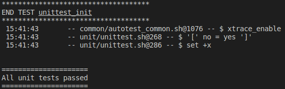
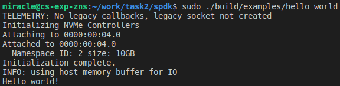
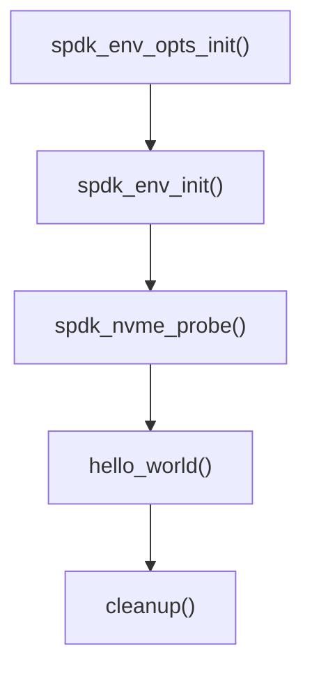
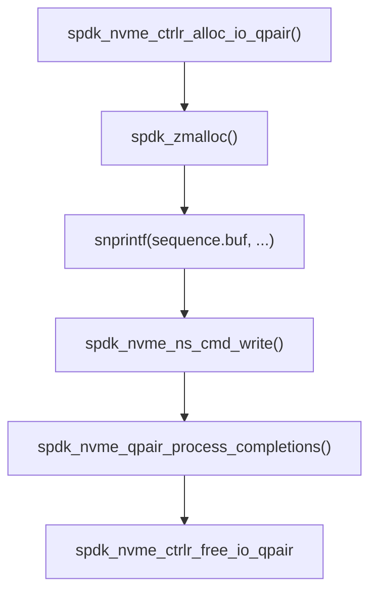
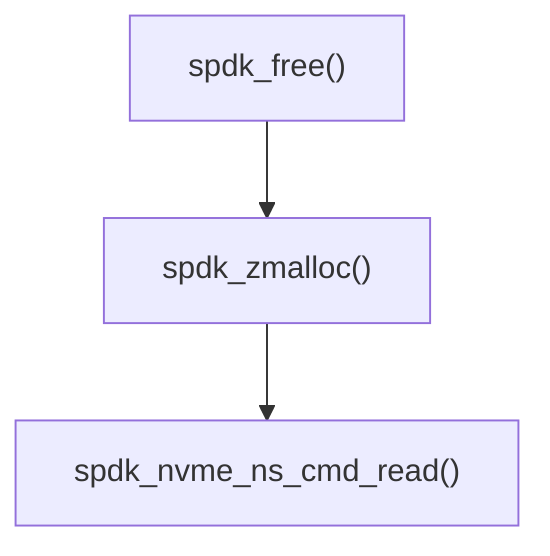
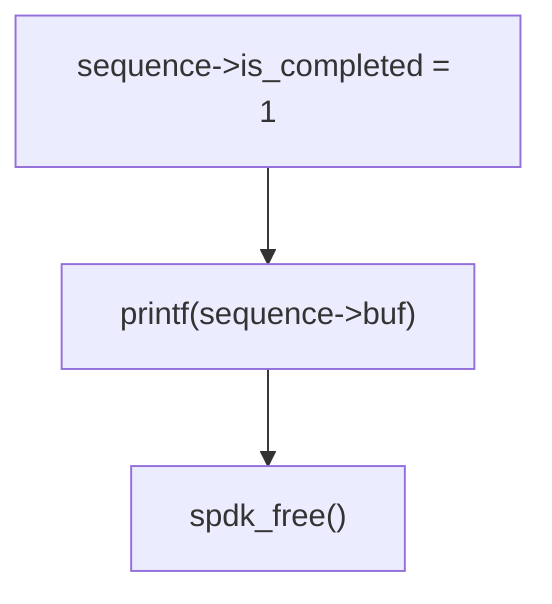

# 实验二、SPDK安装和使用

## 实验目的
- 本实验涉及到计算机组成原理、操作系统、程序设计等多门课程知识，锻炼同学们对业界最新软硬件技术全栈开发能力和学习能力
- NVMe协议已成为最新SSD访问协议，ZNS SSD是最新SSD技术发展成果，NVMe最新协议已增加对ZNS SSD支持， ZNS SSD对于存储系统性能提升有重要意义。本实验通过使用QEMU模拟ZNS SSD设备，基于Intel SPDK框架，在应用中使用ZNS SSD作为底层存储并实现I/O访问，理解从应用层到物理存储设备之间数据读写原理

## 实验内容
- 下载SPDK源代码并编译安装
- 运行NVME hello world程序
- 通过分析NVME hello world源码学习SPDK基本原理
- 修改hello world，实现zns命令I/O读写

## 实验过程和步骤
### 下载SPDK源代码并编译安装
1. 下载源码
```bash
git clone https://github.com/spdk/spdk
cd spdk
git submodule update --init
```
2. 下载依赖
```bash
sudo scripts/pkgdep.sh –all
```
> - The scripts/pkgdep.sh script will automatically install the bare minimum dependencies required to build SPDK. Use --help to see information on installing dependencies for optional components
> - Option –all will install all dependencies needed by SPDK features

3. 编译
```bash
./configure
make
```
4. 单元测试
```bash
./test/unit/unittest.sh
```
> You will see several error messages when running the unit tests, but they are part of the test suite. The final message at the end of the script indicates success or failure
>
> 

5. 安装
```bash
sudo make install
```

### 运行NVME hello world程序

1. 页分配与设备解绑
```bash
sudo scripts/setup.sh
```
> - Before running an SPDK application, some hugepages must be allocated and any NVMe and I/OAT devices must be unbound from the native kernel drivers. SPDK includes a script to automate this process on both Linux and FreeBSD. This script should be run as root. It only needs to be run once on the system
> - To rebind devices back to the kernel, you can run
> ```bash
> sudo scripts/setup.sh reset
> ```
> - By default, the script allocates 2048MB of hugepages. To change this number, specify HUGEMEM (in MB) as follows:
> ```bash
> sudo HUGEMEM=4096 scripts/setup.sh
> ```
> On Linux machines HUGEMEM will be rounded up to system-default huge page size boundary

2. 运行hello world程序
```bash
sudo ./build/examples/hello_world
```


### 通过分析NVME hello world源码学习SPDK基本原理
在 `spdk/examples/nvme/hello_world/hello_world.c` 下查看hello world源码并对关键部分进行分析

1. `main()` 函数处理流程

```c
int main(int argc, char **argv)
{
	int rc;
	struct spdk_env_opts opts;

	/*
	 * SPDK relies on an abstraction around the local environment
	 * named env that handles memory allocation and PCI device operations.
	 * This library must be initialized first.
	 *
	 */
	spdk_env_opts_init(&opts);
	rc = parse_args(argc, argv, &opts);
	if (rc != 0) {
		return rc;
	}

	opts.name = "hello_world";
	if (spdk_env_init(&opts) < 0) {
		fprintf(stderr, "Unable to initialize SPDK env\n");
		return 1;
	}

	printf("Initializing NVMe Controllers\n");

	if (g_vmd && spdk_vmd_init()) {
		fprintf(stderr, "Failed to initialize VMD."
			" Some NVMe devices can be unavailable.\n");
	}

	/*
	 * Start the SPDK NVMe enumeration process.  probe_cb will be called
	 *  for each NVMe controller found, giving our application a choice on
	 *  whether to attach to each controller.  attach_cb will then be
	 *  called for each controller after the SPDK NVMe driver has completed
	 *  initializing the controller we chose to attach.
	 */
	rc = spdk_nvme_probe(&g_trid, NULL, probe_cb, attach_cb, NULL);
	if (rc != 0) {
		fprintf(stderr, "spdk_nvme_probe() failed\n");
		rc = 1;
		goto exit;
	}

	if (TAILQ_EMPTY(&g_controllers)) {
		fprintf(stderr, "no NVMe controllers found\n");
		rc = 1;
		goto exit;
	}

	printf("Initialization complete.\n");
	hello_world();
	cleanup();
	if (g_vmd) {
		spdk_vmd_fini();
	}

exit:
	cleanup();
	spdk_env_fini();
	return rc;
}

```

可以看到 `main()` 函数的主要流程为

其中：
- `spdk_env_opts_init()` 初始化opts参数
- `spdk_env_init()` 初始化环境
- `spdk_nvme_probe()` 加载NVMe设备：通过transport ID枚举总线，并将用户空间NVMe驱动程序附加到发现的每个设备上，具体参数如下
> `int spdk_nvme_probe(const struct spdk_nvme_transport_id *trid, void *cb_ctx, spdk_nvme_probe_cb probe_cb, spdk_nvme_attach_cb attach_cb, spdk_nvme_remove_cb remove_cb)`
> - trid – The transport ID indicating which bus to enumerate. If the trtype is PCIe or trid is NULL, this will scan the local PCIe bus. If the trtype is RDMA, the traddr and trsvcid must point at the location of an NVMe-oF discovery service.
> - cb_ctx – Opaque value which will be passed back in cb_ctx parameter of the callbacks.
> - probe_cb – will be called once per NVMe device found in the system.
> - attach_cb – will be called for devices for which probe_cb returned true once that NVMe controller has been attached to the userspace driver.
> - remove_cb – will be called for devices that were attached in a previous spdk_nvme_probe() call but are no longer attached to the system. Optional; specify NULL if removal notices are not desired.
>
> 返回: 0 on success, -1 on failure.
- `hello_world()` 进行读写操作
- `cleanup()` 释放NVMe设备

接着对 `hello_world()` 函数进行分析
```c
static void hello_world(void)
{
	struct ns_entry			*ns_entry;
	struct hello_world_sequence	sequence;
	int				rc;
	size_t				sz;

	TAILQ_FOREACH(ns_entry, &g_namespaces, link) {
		/*
		 * Allocate an I/O qpair that we can use to submit read/write requests
		 *  to namespaces on the controller.  NVMe controllers typically support
		 *  many qpairs per controller.  Any I/O qpair allocated for a controller
		 *  can submit I/O to any namespace on that controller.
		 *
		 * The SPDK NVMe driver provides no synchronization for qpair accesses -
		 *  the application must ensure only a single thread submits I/O to a
		 *  qpair, and that same thread must also check for completions on that
		 *  qpair.  This enables extremely efficient I/O processing by making all
		 *  I/O operations completely lockless.
		 */
		ns_entry->qpair = spdk_nvme_ctrlr_alloc_io_qpair(ns_entry->ctrlr, NULL, 0);
		if (ns_entry->qpair == NULL) {
			printf("ERROR: spdk_nvme_ctrlr_alloc_io_qpair() failed\n");
			return;
		}

		/*
		 * Use spdk_dma_zmalloc to allocate a 4KB zeroed buffer.  This memory
		 * will be pinned, which is required for data buffers used for SPDK NVMe
		 * I/O operations.
		 */
		sequence.using_cmb_io = 1;
		sequence.buf = spdk_nvme_ctrlr_map_cmb(ns_entry->ctrlr, &sz);
		if (sequence.buf == NULL || sz < 0x1000) {
			sequence.using_cmb_io = 0;
			sequence.buf = spdk_zmalloc(0x1000, 0x1000, NULL, SPDK_ENV_SOCKET_ID_ANY, SPDK_MALLOC_DMA);
		}
		if (sequence.buf == NULL) {
			printf("ERROR: write buffer allocation failed\n");
			return;
		}
		if (sequence.using_cmb_io) {
			printf("INFO: using controller memory buffer for IO\n");
		} else {
			printf("INFO: using host memory buffer for IO\n");
		}
		sequence.is_completed = 0;
		sequence.ns_entry = ns_entry;

		/*
		 * If the namespace is a Zoned Namespace, rather than a regular
		 * NVM namespace, we need to reset the first zone, before we
		 * write to it. This not needed for regular NVM namespaces.
		 */
		if (spdk_nvme_ns_get_csi(ns_entry->ns) == SPDK_NVME_CSI_ZNS) {
			reset_zone_and_wait_for_completion(&sequence);
		}

		/*
		 * Print "Hello world!" to sequence.buf.  We will write this data to LBA
		 *  0 on the namespace, and then later read it back into a separate buffer
		 *  to demonstrate the full I/O path.
		 */
		snprintf(sequence.buf, 0x1000, "%s", "Hello world!\n");

		/*
		 * Write the data buffer to LBA 0 of this namespace.  "write_complete" and
		 *  "&sequence" are specified as the completion callback function and
		 *  argument respectively.  write_complete() will be called with the
		 *  value of &sequence as a parameter when the write I/O is completed.
		 *  This allows users to potentially specify different completion
		 *  callback routines for each I/O, as well as pass a unique handle
		 *  as an argument so the application knows which I/O has completed.
		 *
		 * Note that the SPDK NVMe driver will only check for completions
		 *  when the application calls spdk_nvme_qpair_process_completions().
		 *  It is the responsibility of the application to trigger the polling
		 *  process.
		 */
		rc = spdk_nvme_ns_cmd_write(ns_entry->ns, ns_entry->qpair, sequence.buf,
					    0, /* LBA start */
					    1, /* number of LBAs */
					    write_complete, &sequence, 0);
		if (rc != 0) {
			fprintf(stderr, "starting write I/O failed\n");
			exit(1);
		}

		/*
		 * Poll for completions.  0 here means process all available completions.
		 *  In certain usage models, the caller may specify a positive integer
		 *  instead of 0 to signify the maximum number of completions it should
		 *  process.  This function will never block - if there are no
		 *  completions pending on the specified qpair, it will return immediately.
		 *
		 * When the write I/O completes, write_complete() will submit a new I/O
		 *  to read LBA 0 into a separate buffer, specifying read_complete() as its
		 *  completion routine.  When the read I/O completes, read_complete() will
		 *  print the buffer contents and set sequence.is_completed = 1.  That will
		 *  break this loop and then exit the program.
		 */
		while (!sequence.is_completed) {
			spdk_nvme_qpair_process_completions(ns_entry->qpair, 0);
		}

		/*
		 * Free the I/O qpair.  This typically is done when an application exits.
		 *  But SPDK does support freeing and then reallocating qpairs during
		 *  operation.  It is the responsibility of the caller to ensure all
		 *  pending I/O are completed before trying to free the qpair.
		 */
		spdk_nvme_ctrlr_free_io_qpair(ns_entry->qpair);
	}
}
```
可以看到 `hello_world()` 函数的主要流程为

其中：
- `spdk_nvme_ctrlr_alloc_io_qpair()` 为控制器分配I/O qpair
- `spdk_zmalloc()` 分配buffer
- `snprintf(sequence.buf, ...)` 写入数据到buffer
- `spdk_nvme_ns_cmd_write()` 从buffer写入namespace的LBA 0处
- `spdk_nvme_qpair_process_completions()` 处理I/O Completions
- `spdk_nvme_ctrlr_free_io_qpair` 释放I/O qpair

在本程序中，当写 I/O 完成时， `write_complete()` 中调用了 `spdk_nvme_ns_cmd_read()` 进行读取操作。 当读取 I/O 完成时，`read_complete()` 将打印缓冲区内容并设置  `sequence.is_completed = 1`

`write_complete()` 函数
```c
static void write_complete(void *arg, const struct spdk_nvme_cpl *completion)
{
	struct hello_world_sequence	*sequence = arg;
	struct ns_entry			*ns_entry = sequence->ns_entry;
	int				rc;

	/* See if an error occurred. If so, display information
	 * about it, and set completion value so that I/O
	 * caller is aware that an error occurred.
	 */
	if (spdk_nvme_cpl_is_error(completion)) {
		spdk_nvme_qpair_print_completion(sequence->ns_entry->qpair, (struct spdk_nvme_cpl *)completion);
		fprintf(stderr, "I/O error status: %s\n", spdk_nvme_cpl_get_status_string(&completion->status));
		fprintf(stderr, "Write I/O failed, aborting run\n");
		sequence->is_completed = 2;
		exit(1);
	}
	/*
	 * The write I/O has completed.  Free the buffer associated with
	 *  the write I/O and allocate a new zeroed buffer for reading
	 *  the data back from the NVMe namespace.
	 */
	if (sequence->using_cmb_io) {
		spdk_nvme_ctrlr_unmap_cmb(ns_entry->ctrlr);
	} else {
		spdk_free(sequence->buf);
	}
	sequence->buf = spdk_zmalloc(0x1000, 0x1000, NULL, SPDK_ENV_SOCKET_ID_ANY, SPDK_MALLOC_DMA);

	rc = spdk_nvme_ns_cmd_read(ns_entry->ns, ns_entry->qpair, sequence->buf,
				   0, /* LBA start */
				   1, /* number of LBAs */
				   read_complete, (void *)sequence, 0);
	if (rc != 0) {
		fprintf(stderr, "starting read I/O failed\n");
		exit(1);
	}
}
```
`write_complete()` 流程

其中：
- `spdk_free()` 释放write时分配的buffer
- `spdk_zmalloc()` 为read分配buffer
- `spdk_nvme_ns_cmd_read()` 将namespace的LBA 0读入到buffer中

`read_complete()` 函数
```c
static void read_complete(void *arg, const struct spdk_nvme_cpl *completion)
{
	struct hello_world_sequence *sequence = arg;

	/* Assume the I/O was successful */
	sequence->is_completed = 1;
	/* See if an error occurred. If so, display information
	 * about it, and set completion value so that I/O
	 * caller is aware that an error occurred.
	 */
	if (spdk_nvme_cpl_is_error(completion)) {
		spdk_nvme_qpair_print_completion(sequence->ns_entry->qpair, (struct spdk_nvme_cpl *)completion);
		fprintf(stderr, "I/O error status: %s\n", spdk_nvme_cpl_get_status_string(&completion->status));
		fprintf(stderr, "Read I/O failed, aborting run\n");
		sequence->is_completed = 2;
		exit(1);
	}

	/*
	 * The read I/O has completed.  Print the contents of the
	 *  buffer, free the buffer, then mark the sequence as
	 *  completed.  This will trigger the hello_world() function
	 *  to exit its polling loop.
	 */
	printf("%s", sequence->buf);
	spdk_free(sequence->buf);
}
```
`read_complete()` 流程

 	其中：
- `sequence->is_completed = 1` 修改完成标识，使hello_world中while退出
- `printf("%s", sequence->buf)` 将buffer中数据输出
- `spdk_free()` 释放read的buffer

### 修改hello world，实现zns命令I/O读写

TODO

## 实验结论和心得体会

本次实验编译安装了SPDK；通过运行并分析NVME hello world源码学习了SPDK基本原理；并在此基础上修改hello world，实现了zns命令I/O读写。

## 