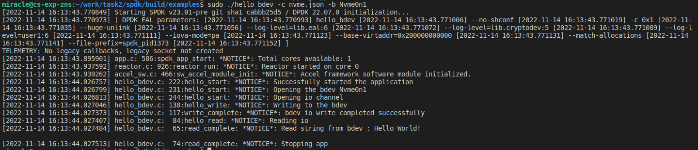
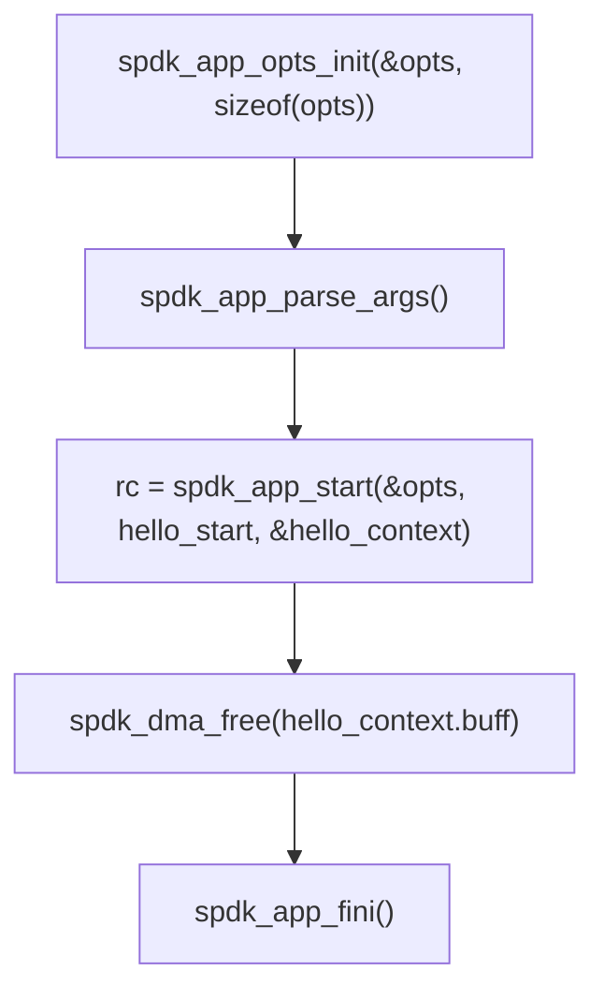
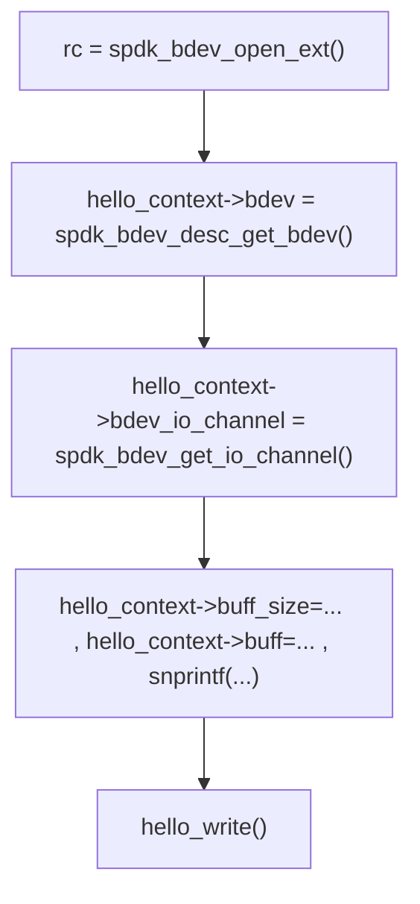
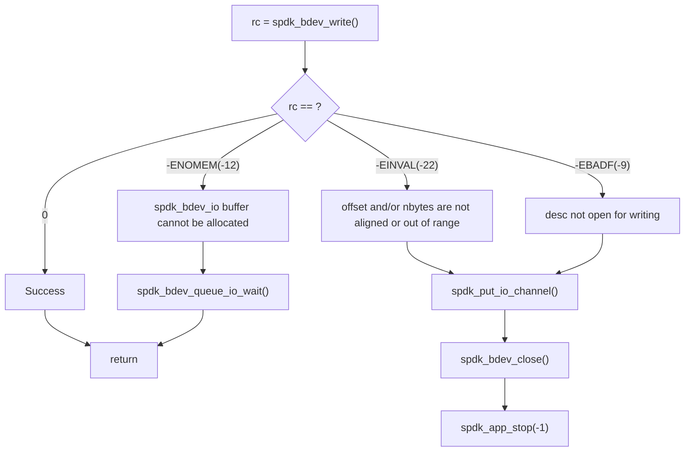
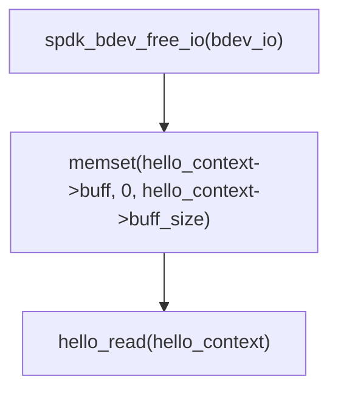
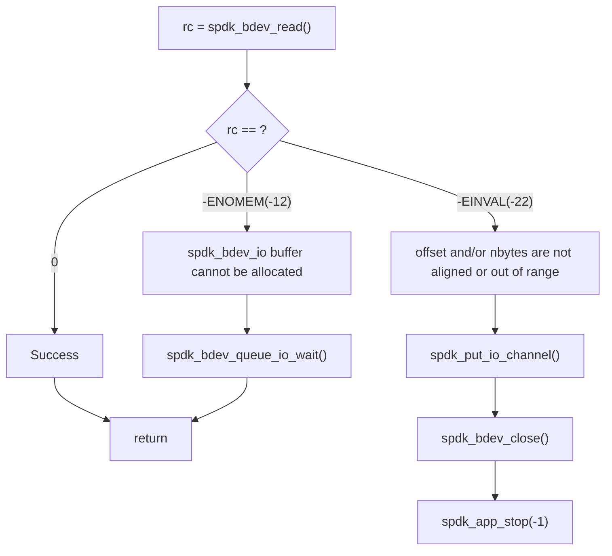
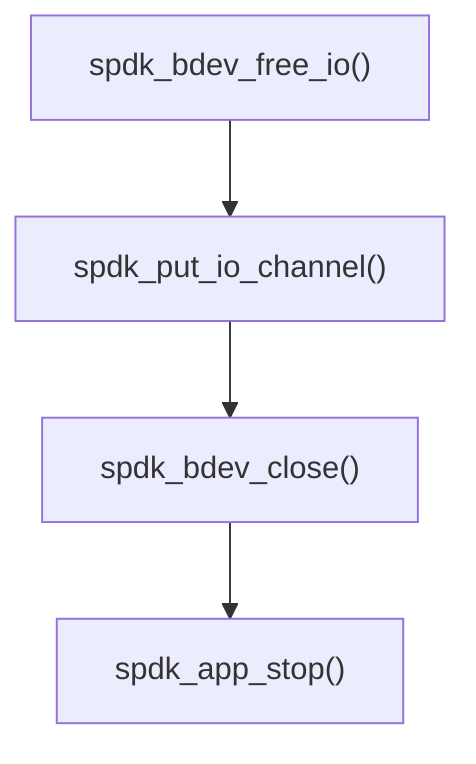

# 实验三、bdev原理和源码分析

## 实验目的

- 学习bdeb原理和基本接口操作

## 实验内容

- 配置bdev运行环境
- 运行hello_bdev程序并分析源码
- 通过bdev接口写入数据并读取

## 实验过程和步骤

### 运行hello_bdev示例
#### 启动虚拟机
```bash
./start.sh ssd
```

#### 初始化环境
```bash
sudo scripts/setup.sh
```
#### 生成配置文件
```bash
./scripts/gen_nvme.sh --json-with-subsystems > ./build/examples/nvme.json
```
#### 运行hello_bdev
```bash
cd build/examples/
sudo ./hello_bdev -c nvme.json -b Nvme0n1
```


### 分析hello_bdev.c源码
#### `main()` 主函数
```c
int main(int argc, char **argv)
{
	struct spdk_app_opts opts = {};
	int rc = 0;
	struct hello_context_t hello_context = {};

	/* Set default values in opts structure. */
	spdk_app_opts_init(&opts, sizeof(opts));
	opts.name = "hello_bdev";

	/*
	 * Parse built-in SPDK command line parameters as well
	 * as our custom one(s).
	 */
	if ((rc = spdk_app_parse_args(argc, argv, &opts, "b:", NULL, hello_bdev_parse_arg,
				      hello_bdev_usage)) != SPDK_APP_PARSE_ARGS_SUCCESS) {
		exit(rc);
	}
	hello_context.bdev_name = g_bdev_name;

	/*
	 * spdk_app_start() will initialize the SPDK framework, call hello_start(),
	 * and then block until spdk_app_stop() is called (or if an initialization
	 * error occurs, spdk_app_start() will return with rc even without calling
	 * hello_start().
	 */
	rc = spdk_app_start(&opts, hello_start, &hello_context);
	if (rc) {
		SPDK_ERRLOG("ERROR starting application\n");
	}

	/* At this point either spdk_app_stop() was called, or spdk_app_start()
	 * failed because of internal error.
	 */

	/* When the app stops, free up memory that we allocated. */
	spdk_dma_free(hello_context.buff);

	/* Gracefully close out all of the SPDK subsystems. */
	spdk_app_fini();
	return rc;
}
```
主要流程为

其中：
- `spdk_app_opts_init()` 初始化opts参数
- `spdk_app_parse_args()` 载入spdk默认参数和用户自定义参数（如：`-c nvme.json` 等）
- `rc = spdk_app_start(&opts, hello_start, &hello_context)` 载入SPDK框架，调用 `hello_start` 函数，并在调用 `spdk_app_stop()` 后返回状态值
- `spdk_dma_free()` 释放分配的空间
- `spdk_app_fini()` 关闭所有SPDK子系统

#### `hello_start()` 主任务函数
```c
static void hello_start(void *arg1)
{
	struct hello_context_t *hello_context = arg1;
	uint32_t buf_align;
	int rc = 0;
	hello_context->bdev = NULL;
	hello_context->bdev_desc = NULL;

	SPDK_NOTICELOG("Successfully started the application\n");

	/*
	 * There can be many bdevs configured, but this application will only use
	 * the one input by the user at runtime.
	 *
	 * Open the bdev by calling spdk_bdev_open_ext() with its name.
	 * The function will return a descriptor
	 */
	SPDK_NOTICELOG("Opening the bdev %s\n", hello_context->bdev_name);
	rc = spdk_bdev_open_ext(hello_context->bdev_name, true, hello_bdev_event_cb, NULL,
				&hello_context->bdev_desc);
	if (rc) {
		SPDK_ERRLOG("Could not open bdev: %s\n", hello_context->bdev_name);
		spdk_app_stop(-1);
		return;
	}

	/* A bdev pointer is valid while the bdev is opened. */
	hello_context->bdev = spdk_bdev_desc_get_bdev(hello_context->bdev_desc);


	SPDK_NOTICELOG("Opening io channel\n");
	/* Open I/O channel */
	hello_context->bdev_io_channel = spdk_bdev_get_io_channel(hello_context->bdev_desc);
	if (hello_context->bdev_io_channel == NULL) {
		SPDK_ERRLOG("Could not create bdev I/O channel!!\n");
		spdk_bdev_close(hello_context->bdev_desc);
		spdk_app_stop(-1);
		return;
	}

	/* Allocate memory for the write buffer.
	 * Initialize the write buffer with the string "Hello World!"
	 */
	hello_context->buff_size = spdk_bdev_get_block_size(hello_context->bdev) *
				   spdk_bdev_get_write_unit_size(hello_context->bdev);
	buf_align = spdk_bdev_get_buf_align(hello_context->bdev);
	hello_context->buff = spdk_dma_zmalloc(hello_context->buff_size, buf_align, NULL);
	if (!hello_context->buff) {
		SPDK_ERRLOG("Failed to allocate buffer\n");
		spdk_put_io_channel(hello_context->bdev_io_channel);
		spdk_bdev_close(hello_context->bdev_desc);
		spdk_app_stop(-1);
		return;
	}
	snprintf(hello_context->buff, hello_context->buff_size, "%s", "Hello World!\n");

	if (spdk_bdev_is_zoned(hello_context->bdev)) {
		hello_reset_zone(hello_context);
		/* If bdev is zoned, the callback, reset_zone_complete, will call hello_write() */
		return;
	}

	hello_write(hello_context);
}
```
主要流程为

其中：
- `spdk_bdev_open_ext()` 通过设备名（如运行程序是附加的参数 `-b Nvme0n1`）打开bdev，返回一个descriptor
- `spdk_bdev_desc_get_bdev()` 通过descriptor获取bdev指针
- `spdk_bdev_get_io_channel()` 通过descriptor获取I/O通道
- `hello_context->buff_size=... , hello_context->buff=... , snprintf(...)` 为写入buffer分配空间并写入字符串
- `hello_write()` 调用写入函数

#### `hello_write()` 写入函数
下面对写入函数进行分析
```c
static void hello_write(void *arg)
{
	struct hello_context_t *hello_context = arg;
	int rc = 0;

	SPDK_NOTICELOG("Writing to the bdev\n");
	rc = spdk_bdev_write(hello_context->bdev_desc, hello_context->bdev_io_channel,
			     hello_context->buff, 0, hello_context->buff_size, write_complete,
			     hello_context);

	if (rc == -ENOMEM) {
		SPDK_NOTICELOG("Queueing io\n");
		/* In case we cannot perform I/O now, queue I/O */
		hello_context->bdev_io_wait.bdev = hello_context->bdev;
		hello_context->bdev_io_wait.cb_fn = hello_write;
		hello_context->bdev_io_wait.cb_arg = hello_context;
		spdk_bdev_queue_io_wait(hello_context->bdev, hello_context->bdev_io_channel,
					&hello_context->bdev_io_wait);
	} else if (rc) {
		SPDK_ERRLOG("%s error while writing to bdev: %d\n", spdk_strerror(-rc), rc);
		spdk_put_io_channel(hello_context->bdev_io_channel);
		spdk_bdev_close(hello_context->bdev_desc);
		spdk_app_stop(-1);
	}
}
```
主要流程为

其中：
- `spdk_bdev_write()` 向bdev写入，并在完成后调用相应回调函数
- `spdk_bdev_queue_io_wait()` 加入I/O等待队列
- `spdk_put_io_channel()` 释放I/O通道，并在释放最后一个通道后调用销毁回调函数
- `spdk_bdev_close()` 关闭块设备（bdev，block device）

#### `write_complete()` 写入回调函数
```c
static void write_complete(struct spdk_bdev_io *bdev_io, bool success, void *cb_arg)
{
	struct hello_context_t *hello_context = cb_arg;

	/* Complete the I/O */
	spdk_bdev_free_io(bdev_io);

	if (success) {
		SPDK_NOTICELOG("bdev io write completed successfully\n");
	} else {
		SPDK_ERRLOG("bdev io write error: %d\n", EIO);
		spdk_put_io_channel(hello_context->bdev_io_channel);
		spdk_bdev_close(hello_context->bdev_desc);
		spdk_app_stop(-1);
		return;
	}

	/* Zero the buffer so that we can use it for reading */
	memset(hello_context->buff, 0, hello_context->buff_size);

	hello_read(hello_context);
}
```
主要流程为

其中：
- `spdk_bdev_free_io()` Free an I/O request
- `memset(...)` 将buffer置为0,便于后续存储读取的数据
- `hello_read()` 调用读取函数

#### `hello_read()` 读取函数
```c
static void hello_read(void *arg)
{
	struct hello_context_t *hello_context = arg;
	int rc = 0;

	SPDK_NOTICELOG("Reading io\n");
	rc = spdk_bdev_read(hello_context->bdev_desc, hello_context->bdev_io_channel,
			    hello_context->buff, 0, hello_context->buff_size, read_complete,
			    hello_context);

	if (rc == -ENOMEM) {
		SPDK_NOTICELOG("Queueing io\n");
		/* In case we cannot perform I/O now, queue I/O */
		hello_context->bdev_io_wait.bdev = hello_context->bdev;
		hello_context->bdev_io_wait.cb_fn = hello_read;
		hello_context->bdev_io_wait.cb_arg = hello_context;
		spdk_bdev_queue_io_wait(hello_context->bdev, hello_context->bdev_io_channel,
					&hello_context->bdev_io_wait);
	} else if (rc) {
		SPDK_ERRLOG("%s error while reading from bdev: %d\n", spdk_strerror(-rc), rc);
		spdk_put_io_channel(hello_context->bdev_io_channel);
		spdk_bdev_close(hello_context->bdev_desc);
		spdk_app_stop(-1);
	}
}
```
主要流程为

其中：
- `spdk_bdev_write()` 从bdev读取，并在完成后调用相应回调函数

#### `read_complete()` 读取回调函数
```c
static void read_complete(struct spdk_bdev_io *bdev_io, bool success, void *cb_arg)
{
	struct hello_context_t *hello_context = cb_arg;

	if (success) {
		SPDK_NOTICELOG("Read string from bdev : %s\n", hello_context->buff);
	} else {
		SPDK_ERRLOG("bdev io read error\n");
	}

	/* Complete the bdev io and close the channel */
	spdk_bdev_free_io(bdev_io);
	spdk_put_io_channel(hello_context->bdev_io_channel);
	spdk_bdev_close(hello_context->bdev_desc);
	SPDK_NOTICELOG("Stopping app\n");
	spdk_app_stop(success ? 0 : -1);
}
```
主要流程为


### 修改hello_bdev.c，实现自定义字符串读写
> 生成256KB字符串数据，修改hello_bdev.c源码将字符串数据通过bdev写入，之后再读取，验证结果是否正确

TODO

## 实验结论和心得体会

本次实验配置了bdev运行环境，运行并分析了hello_bdev程序，并最终独立编写实现了通过bdev接口的数据写入与读取。