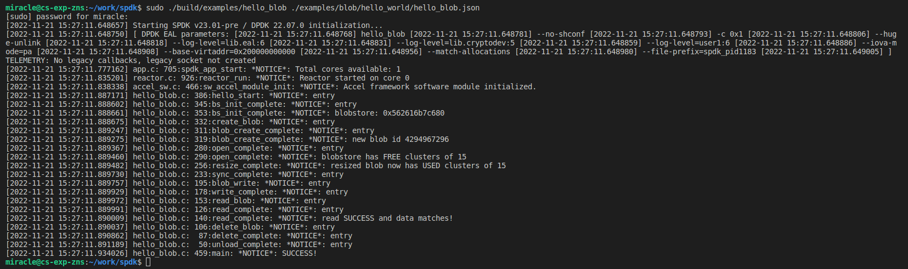
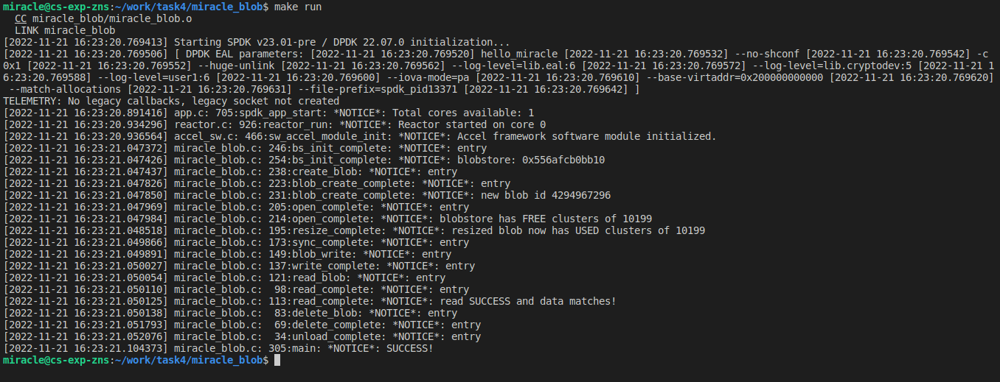

# 实验四、blobstore原理和源码分析

## 实验目的

- 学习blob原理和基本接口操作

## 实验内容

- 学习Blob基本原理
- 完成hello_blob 程序运行
- 修改底层bdev为nvme

## 实验过程和步骤

### 运行hello_blob示例
#### 启动虚拟机
```bash
./start.sh ssd
```

#### 初始化环境
```bash
sudo scripts/setup.sh
```

#### 运行hello_blob
在spdk文件夹下
```bash
sudo ./build/examples/hello_blob ./examples/blob/hello_world/hello_blob.json
```



### 修改hello_blob.c，替换ramdisk为nvme
#### `miracle_blob.c`
```c
#include "spdk/stdinc.h"

#include "spdk/bdev.h"
#include "spdk/env.h"
#include "spdk/event.h"
#include "spdk/blob_bdev.h"
#include "spdk/blob.h"
#include "spdk/log.h"
#include "spdk/string.h"

struct my_context
{
    struct spdk_blob_store *bs;
    struct spdk_blob *blob;
    spdk_blob_id blobid;
    struct spdk_io_channel *channel;
    uint8_t *read_buff;
    uint8_t *write_buff;
    uint64_t io_unit_size;
    int rc;
};

static void cleanup(struct my_context *p)
{
    spdk_free(p->read_buff);
    spdk_free(p->write_buff);
    free(p);
}

static void unload_complete(void *cb_arg, int bserrno)
{
    struct my_context *p = cb_arg;

    SPDK_NOTICELOG("entry\n");
    if (bserrno)
    {
        SPDK_ERRLOG("Error %d unloading the bobstore\n", bserrno);
        p->rc = bserrno;
    }

    spdk_app_stop(p->rc);
}

static void unload_bs(struct my_context *p, char *msg, int bserrno)
{
    if (bserrno)
    {
        SPDK_ERRLOG("%s (err %d)\n", msg, bserrno);
        p->rc = bserrno;
    }
    if (p->bs)
    {
        if (p->channel)
        {
            spdk_bs_free_io_channel(p->channel);
        }
        spdk_bs_unload(p->bs, unload_complete, p);
    }
    else
    {
        spdk_app_stop(bserrno);
    }
}

static void delete_complete(void *arg1, int bserrno)
{
    struct my_context *p = arg1;

    SPDK_NOTICELOG("entry\n");
    if (bserrno)
    {
        unload_bs(p, "Error in delete completion", bserrno);
        return;
    }

    unload_bs(p, "", 0);
}

static void delete_blob(void *arg1, int bserrno)
{
    struct my_context *p = arg1;

    SPDK_NOTICELOG("entry\n");
    if (bserrno)
    {
        unload_bs(p, "Error in close completion", bserrno);
        return;
    }

    spdk_bs_delete_blob(p->bs, p->blobid, delete_complete, p);
}

static void read_complete(void *arg1, int bserrno)
{
    struct my_context *p = arg1;
    int match_res = -1;

    SPDK_NOTICELOG("entry\n");
    if (bserrno)
    {
        unload_bs(p, "Error in read completion", bserrno);
        return;
    }

    match_res = memcmp(p->write_buff, p->read_buff, p->io_unit_size);
    if (match_res)
    {
        unload_bs(p, "Error in data compare", -1);
        return;
    }
    else
    {
        SPDK_NOTICELOG("read SUCCESS and data matches!\n");
    }

    spdk_blob_close(p->blob, delete_blob, p);
}

static void read_blob(struct my_context *p)
{
    SPDK_NOTICELOG("entry\n");

    p->read_buff = spdk_malloc(p->io_unit_size, 0x1000, NULL, SPDK_ENV_LCORE_ID_ANY, SPDK_MALLOC_DMA);
    if (p->read_buff == NULL)
    {
        unload_bs(p, "Error in memory allocation", -ENOMEM);
        return;
    }

    spdk_blob_io_read(p->blob, p->channel, p->read_buff, 0, 1, read_complete, p);
}

static void write_complete(void *arg1, int bserrno)
{
    struct my_context *p = arg1;

    SPDK_NOTICELOG("entry\n");
    if (bserrno)
    {
        unload_bs(p, "Error in write completion", bserrno);
        return;
    }

    read_blob(p);
}

static void blob_write(struct my_context *p)
{
    SPDK_NOTICELOG("entry\n");

    p->write_buff = spdk_malloc(p->io_unit_size, 0x1000, NULL, SPDK_ENV_LCORE_ID_ANY, SPDK_MALLOC_DMA);
    if (p->write_buff == NULL)
    {
        unload_bs(p, "Error in allocating memory", -ENOMEM);
        return;
    }
    memset(p->write_buff, 0x5a, p->io_unit_size);

    p->channel = spdk_bs_alloc_io_channel(p->bs);
    if (p->channel == NULL)
    {
        unload_bs(p, "Error in allocating channel", -ENOMEM);
        return;
    }

    spdk_blob_io_write(p->blob, p->channel, p->write_buff, 0, 1, write_complete, p);
}

static void sync_complete(void *arg1, int bserrno)
{
    struct my_context *p = arg1;

    SPDK_NOTICELOG("entry\n");
    if (bserrno)
    {
        unload_bs(p, "Error in sync callback", bserrno);
        return;
    }

    blob_write(p);
}

static void resize_complete(void *cb_arg, int bserrno)
{
    struct my_context *p = cb_arg;
    uint64_t total = 0;

    if (bserrno)
    {
        unload_bs(p, "Error in blob resize", bserrno);
        return;
    }

    total = spdk_blob_get_num_clusters(p->blob);
    SPDK_NOTICELOG("resized blob now has USED clusters of %" PRIu64 "\n", total);

    spdk_blob_sync_md(p->blob, sync_complete, p);
}

static void open_complete(void *cb_arg, struct spdk_blob *blob, int bserrno)
{
    struct my_context *p = cb_arg;
    uint64_t free = 0;

    SPDK_NOTICELOG("entry\n");
    if (bserrno)
    {
        unload_bs(p, "Error in open completion", bserrno);
        return;
    }

    p->blob = blob;
    free = spdk_bs_free_cluster_count(p->bs);
    SPDK_NOTICELOG("blobstore has FREE clusters of %" PRIu64 "\n", free);

    spdk_blob_resize(p->blob, free, resize_complete, p);
}

static void blob_create_complete(void *arg1, spdk_blob_id blobid, int bserrno)
{
    struct my_context *p = arg1;

    SPDK_NOTICELOG("entry\n");
    if (bserrno)
    {
        unload_bs(p, "Error in blob create callback", bserrno);
        return;
    }

    p->blobid = blobid;
    SPDK_NOTICELOG("new blob id %" PRIu64 "\n", p->blobid);

    spdk_bs_open_blob(p->bs, p->blobid, open_complete, p);
}

static void create_blob(struct my_context *p)
{
    SPDK_NOTICELOG("entry\n");
    spdk_bs_create_blob(p->bs, blob_create_complete, p);
}

static void bs_init_complete(void *cb_arg, struct spdk_blob_store *bs, int bserrno)
{
    struct my_context *p = cb_arg;

    SPDK_NOTICELOG("entry\n");
    if (bserrno)
    {
        unload_bs(p, "Error initing the blobstore", bserrno);
        return;
    }

    p->bs = bs;
    SPDK_NOTICELOG("blobstore: %p\n", p->bs);

    p->io_unit_size = spdk_bs_get_io_unit_size(p->bs);

    create_blob(p);
}

static void base_bdev_event_cb(enum spdk_bdev_event_type type, struct spdk_bdev *bdev, void *event_ctx)
{
    SPDK_WARNLOG("Unsupported bdev event: type %d\n", type);
}

static void hello_start(void *arg1)
{
    struct my_context *p = arg1;
    struct spdk_bs_dev *bs_dev = NULL;
    int rc;
    rc = spdk_bdev_create_bs_dev_ext("Nvme0n1", base_bdev_event_cb, NULL, &bs_dev);
    if (rc != 0)
    {
        SPDK_ERRLOG("Could not create blob bdev, %s!!\n", spdk_strerror(-rc));
        spdk_app_stop(-1);
        return;
    }

    spdk_bs_init(bs_dev, NULL, bs_init_complete, p);
}

int main(int argc, char **argv)
{
    struct spdk_app_opts opts = {};
    int rc = 0;
    struct my_context *p = NULL;

    SPDK_NOTICELOG("entry\n");

    spdk_app_opts_init(&opts, sizeof(opts));

    opts.name = "hello_miracle";
    opts.json_config_file = argv[1];

    p = calloc(1, sizeof(struct my_context));
    if (p)
    {
        rc = spdk_app_start(&opts, hello_start, p);
        if (rc)
        {
            SPDK_NOTICELOG("ERROR!\n");
        }
        else
        {
            SPDK_NOTICELOG("SUCCESS!\n");
        }
        cleanup(p);
    }
    else
    {
        SPDK_ERRLOG("Could not alloc hello_context struct!!\n");
        rc = -ENOMEM;
    }
    spdk_app_fini();
    return rc;
}

```

#### `Makefile`
```makefile
SPDK_ROOT_DIR := /home/miracle/work/spdk
include $(SPDK_ROOT_DIR)/mk/spdk.common.mk
include $(SPDK_ROOT_DIR)/mk/spdk.modules.mk

APP = miracle_blob

C_SRCS := miracle_blob.c

SPDK_LIB_LIST = $(ALL_MODULES_LIST) event event_bdev

include $(SPDK_ROOT_DIR)/mk/spdk.app.mk

run: all
	@ rm -f miracle_blob.d miracle_blob.o
	@ $(SPDK_ROOT_DIR)/scripts/gen_nvme.sh --json-with-subsystems > ./miracle_bdev.json
	@ sudo ./miracle_blob ./miracle_bdev.json
```

#### 运行结果




## 实验结论和心得体会

本次实验学习了Blob基本原理，运行并分析了hello_bdev程序，并最修改底层bdev为nvme并成功运行。