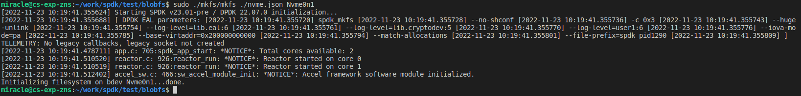
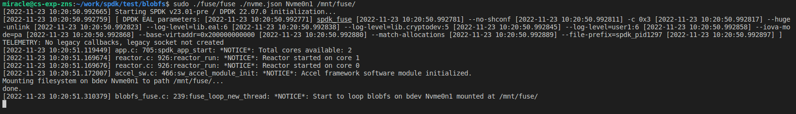

# 实验五、blobFS原理和源码分析

## 实验目的

- 学习BlobFS基本原理,创建并挂载BlobFS

## 实验内容

- 学习BlobFS基本原理
- 在Nvme上创建BlobFS
- 通过Fuse挂载BlobFS

## 实验过程和步骤

### 启动虚拟机

```bash
./start.sh ssd
```

### 初始化环境

在spdk目录下

```bash
sudo HUGEMEM=5120 ./scripts/setup.sh
```

### 安装fuse依赖

```bash
sudo apt install libfuse3-dev
```

### 编译

```bash
./configure --with-fuse
make -j$(nproc)
```

### 生成NVMe配置文件

```bash
./scripts/gen_nvme.sh --json-with-subsystems > ./test/blobfs/nvme.json
```

### 创建一个空的SPDK blobfs

在 `spdk/test/blobfs/`目录下

```bash
sudo ./mkfs/mkfs ./nvme.json Nvme0n1
```



### 创建挂载的目录

```bash
sudo mkdir /mnt/fuse
```

### 运行fuse示例程序

在 `spdk/test/blobfs/`目录下

```bash
sudo ./fuse/fuse ./nvme.json Nvme0n1 /mnt/fuse/
```



## 实验结论和心得体会

本次实验通过学习BlobFS基本原理在Nvme上创建了BlobFS并通过Fuse对其进行挂载。
